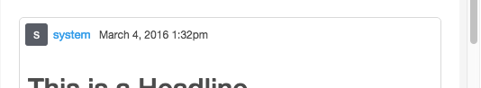
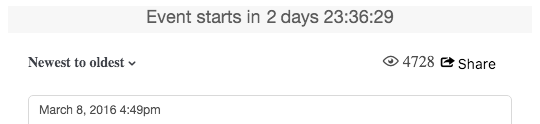

# Storify CSS Classes{#storify-css-classes}

Classi CSS disponibili per le app Storify.

Utilizzate CSS per personalizzare le app Storify per un'integrazione più completa con la pagina, ignorando semplicemente il CSS predefinito con il vostro foglio di stile. In questa sezione sono descritte le personalizzazioni CSS disponibili.

## Elementi autore {#section_tdy_hsh_xz}

Consente di personalizzare lo stile per l'avatar dell'autore del post, il nome dell'autore e la marca temporale.

| Classe | Descrizione |
|---|---|
| . s-author-name | Autore |
| . s-author-avatar | L'avatar dell'autore. |
| . s-img | L'immagine avatar dell'autore. |
| . s-timestamp | È stata pubblicata la marca temporale relativa al contenuto della data. |

## Elementi intestazione {#section_nbv_gsh_xz}

Consente di personalizzare la sezione dell'intestazione relativa alla pagina del brano.

| **Classe** | **Descrizione** |
|---|---|
| . super-header | Intestazione principale |
| . outer-header | Riga di intestazione principale 1 |
| . s-countdown | Timer della countdown riga principale 1 |
| . s-liveness | Stato della riga di intestazione principale 1 «Live» |
| . base-header | Riga di intestazione principale 2 |
| . s-a discesa | Trigger a discesa della riga di intestazione principale 2 Sort. |
| . s-a discesa, menu | Menu a discesa Ordina riga 2 principale. |
| . s-dropdown-triangle | Accento circonflesso della riga di intestazione principale 2 Ordina. |
| . s-dropdown-option | Voce di menu a discesa Riga di intestazione principale 2 Sort. |
| . s-views | Riga di intestazione principale 2 numero di visualizzazioni. |
| Pulsante. s-share-button | Pulsante della riga di intestazione principale 2. |
| . s-share-menu | Menu della riga di intestazione principale 2. |

## Post Elements {#section_lrs_fsh_xz}

Consente di personalizzare lo stile per gli elementi del brano del post.

| **Classe** | **Descrizione** |
|---|---|
| . s-liveblog | Contenitore per l'intero elemento Story |
| . s-post | Il contenitore post |
| . s-mod@-@ content | Contenitore modale post |
| . s-element-content | Tutti gli elementi di contenuto all'interno di un post |
| . s-element-text ul | Elemento testo |
| . s-element-text h 2 | Intestazione elemento testo |
| . s-element-text p | Paragrafo elemento testo |
| . s-element-text ul | Elemento testo non ordinato |
| . s-element-text ol | Elenco ordinato elemento di testo |
| . s-element-text li | Voci di elenco elementi di testo |
| . s-element-text blockquote | Blockquote |
| . s-element-text blockquote: before | Icona dell'inizio di un blockquote |
| . s-element-text blockquote: after | Icona relativa alla fine di un blockquote |
| . s-element-image | Contenitore elemento immagine in linea |
| . s-img | `` element |
| . s-image-caption | Didascalia per immagini e video trovati sui social media (ex: Immagine Instagram |
| . s-upload-image-caption | Didascalia per immagini e video caricati tramite l'Editor brani |
| . s-element-video | Elemento video |
| . s-element-quote | Elemento citazione (ex: Solo tweet w/testo |
| . s-element-quote-image | Elemento etichetta/immagine (ex: Tweet w/image) |
| . s-element-quote-video | Elemento tel/video (ex: Tweet w/video) |
| . s-link-body | Anteprima collegamento all'interno di una virgoletta (ex: Anteprima di un tweet w/link |

## Elementi piè di pagina {#section_ozc_zrh_xz}

Consente di personalizzare la sezione piè di pagina per ogni singolo post.

| **Classe** | **Descrizione** |
|---|---|
| . s-post-footer | Il piè di pagina del post. |
| . s-sidenotes | Pulsante Sidenotes nel piè di pagina del post. |
| . s-like | Pulsante «Like» nel piè di pagina del post. |
