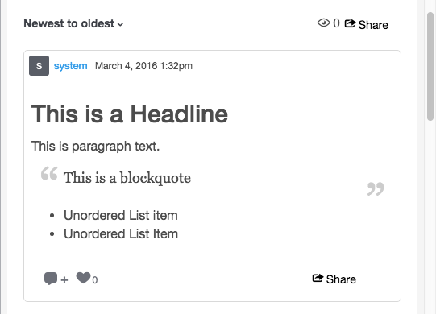

# Storizzare le classi CSS{#storify-css-classes}

Classi CSS disponibili per le app di Storify.

Utilizzate i CSS per personalizzare le app di Storify per una più completa integrazione con la pagina, semplicemente ignorando il CSS predefinito con il vostro foglio di stile. Questa sezione descrive le personalizzazioni CSS disponibili.

## Elementi autore {#section_tdy_hsh_xz}

Consente di personalizzare lo stile per l’avatar dell’autore del post, il nome dell’autore e la marca temporale.

| Classe | Descrizione |
|---|---|
| .s-author-name | Autore |
| s-author-avatar | L’avatar dell’autore. |
| .s-img | Immagine avatar dell’autore. |
| .s-timestamp | La marca temporale per il contenuto della data è stata pubblicata. |

## Elementi intestazione {#section_nbv_gsh_xz}

Consente di personalizzare la sezione di intestazione della pagina del racconto.

| **Classe** | **Descrizione** |
|---|---|
| .super-header | Intestazione principale |
| .external-header | Riga intestazione principale 1 |
| .s-conto alla rovescia | Timer conto alla rovescia per riga intestazione principale 1 |
| .s vivacità | Riga di intestazione principale 1 Stato &quot;Live&quot; |
| .base-header | Riga intestazione principale 2 |
| .s-menu a discesa | Riga di intestazione principale 2 Attivazione del menu a discesa Ordina. |
| .s-menu a discesa | Riga di intestazione principale 2 Menu a discesa Ordina. |
| .s-dropdown-triangle | Riga di intestazione principale 2 Punto menu a discesa Ordina. |
| .s-dropdown-option | Riga di intestazione principale 2 Voce di menu a discesa Ordina. |
| .s-views | Riga di intestazione principale 2 numero di visualizzazioni. |
| Pulsante .s-share-button | Riga di intestazione principale 2 Pulsante Condividi. |
| .s-share-menu | Riga di intestazione principale 2 Menu di condivisione. |

## Post Elements {#section_lrs_fsh_xz}

Consente di personalizzare lo stile degli elementi del brano del post.

| **Classe** | **Descrizione** |
|---|---|
| .s-liveblog | Contenitore per l’intero elemento Story |
| .s-post | Il contenitore di posta |
| .s-modale-content | Contenitore modale |
| .s-element-content | Tutti gli elementi di contenuto all&#39;interno di un post |
| .s-element-text ul | Elemento testo |
| .s-element-text h2 | Titolo elemento di testo |
| .s-element-text p | Paragrafo elemento testo |
| .s-element-text ul | Elenco non ordinato degli elementi di testo |
| .s-element-text ol | Elenco ordinato elemento di testo |
| .s-element-text li | Elementi di elenco degli elementi di testo |
| .s-element-text blockquote | Blockquote |
| .s-element-text blockquote:before | Icona per l&#39;inizio di un&#39;offerta di blocco |
| .s-element-text blockquote:after | Icona per la fine di un blockquote |
| .s-element-image | Contenitore di elementi immagine in linea |
| .s-img | `` element |
| .s-image-caption | Didascalia per immagini e video trovati sui social media (ad esempio: Immagine di Instagram) |
| .s-upload-image-caption | Didascalia per immagini e video caricati tramite l’editor Story |
| .s-element-video | Elemento video |
| .s-element-quote | Elemento del preventivo (ad esempio: Tweet con solo testo) |
| .s-element-quote-image | Preventivo con elemento immagine (ad esempio: Tweet con immagine) |
| .s-element-quote-video | Preventivo con elemento video (ad esempio: Tweet con video) |
| .s-link-body | Anteprima collegamento all’interno di un’offerta (ad esempio: Tweet con anteprima collegamento) |

## Elementi piè di pagina {#section_ozc_zrh_xz}

Consente di personalizzare la sezione piè di pagina per ogni singolo post.

| **Classe** | **Descrizione** |
|---|---|
| .s-post-piè di pagina | Il piè di pagina del post. |
| .s-sidenotes a | Il pulsante Note nel piè di pagina del post. |
| tipo s | Il pulsante &quot;Mi piace&quot; nel piè di pagina del post. |
