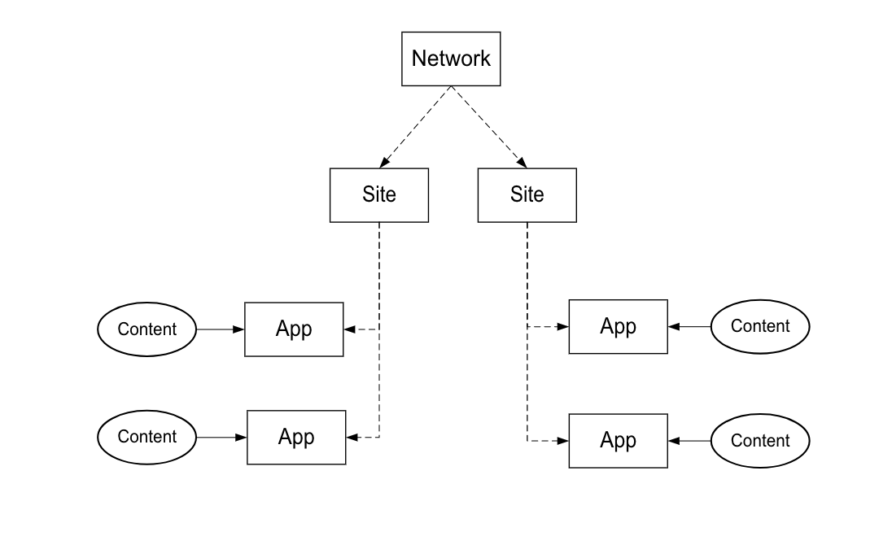

# Processo di implementazione{#implementation-process}

Il periodo di tempo necessario per implementare Livefyre dipende dall’implementazione e dall’ambito di lavoro.

## Panoramica dell’ architettura di rete Livefyre {#section_dgj_l32_rbb}

Livefyre utilizza i seguenti termini per discutere dell&#39;architettura di rete:

* Rete. Il dominio di primo livello su cui intendi utilizzare Livefyre.
* Siti. Un sottodominio o una sezione del sito che fa parte della rete.
* iOS. Rendering di contenuti sul sito. Il contenuto viene visualizzato visivamente nelle app, utilizzando le app di visualizzazione (Mosaic, Carosello, Feature Card, ecc.) o in formato testo, utilizzando le app di conversazione (commenti, recensioni, chat, ecc.). Puoi inserire una o più app sui tuoi siti.
* Streams. I flussi sono filtri che eseguono ricerche nei social media e in altri siti per raccogliere automaticamente i contenuti per la moderazione o la pubblicazione diretta in un&#39;app.
* Contenuto (ad esempio, UGC, commenti). Cosa viene visualizzato nelle app. Il contenuto può essere visivo (ad esempio, una foto o un video), solo audio o testo.

Il diagramma seguente mostra la relazione tra Rete, Siti, App e Contenuto.

Hai la tua istanza Livefyre che è la dashboard centrale per la moderazione dei contenuti, la gestione degli utenti e altro ancora. Contatta il tuo CSM per accedere alla tua istanza Livefyre.

## Passaggi per l’integrazione {#section_s2j_d2x_tz}

Ci sono tre passaggi principali per integrare Livefyre:

* Integrazione app

   Quando implementi Livefyre, lo stile di implementazione dipende dal tuo caso d’uso. Per [ulteriori informazioni su ciascun tipo di implementazione](/help/implementation/c-getting-started/c-implementation-process/c-app-integration-types.md#c_app_integration_types).

* Integrazione dell&#39;autenticazione

   Devi integrare il tuo sistema di gestione utenti esistente con Livefyre per le app di conversazione e qualsiasi altra app che richieda l’autenticazione dell’utente finale sul tuo sito. Se al momento non utilizzi uno strumento di gestione degli utenti, puoi utilizzare Livefyre Identity. Per [ulteriori informazioni su Livefyre Identity, cosa è e come configurarlo](/help/implementation/c-livefyre-identity-comp/c-livefyre-identity-comp.md#c_livefyre_identity).

* Personalizzazione

   La personalizzazione è facoltativa, ma la maggior parte dei clienti personalizza le app in base al proprio marchio.
