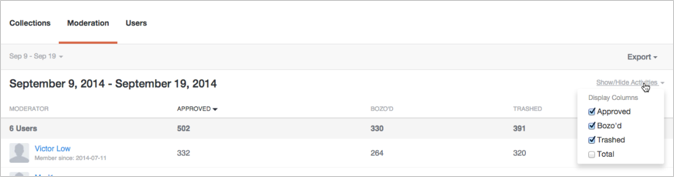
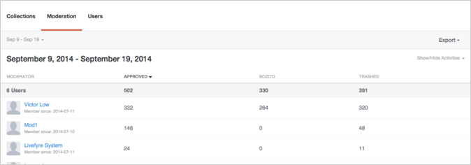

# Analytics{#analytics}

Analizzare l&#39;utente, il contenuto e l&#39;attività moderatore per il sito.

## Analytics {#topic_22D8FAE581CD440EA02B1595520F60C2}

Analizzare l&#39;utente, il contenuto e l&#39;attività moderatore per il sito.

Livefyre Analytics consente di accedere facilmente ai dati di rete in modo semplice e facile da leggere per i dati delle conversazioni, moderazione e utente. Utilizzate queste dashboard per monitorare l&#39;attività ed eseguire analisi rapide sui vostri siti.

I dashboard possono essere filtrati per sito, data e attività. Utilizzate il pulldown di rete in alto a sinistra nella finestra per selezionare un sito da visualizzare. Una volta generata, fate clic su un&#39;intestazione di colonna per ordinare o passare il mouse sul grafico per informazioni più specifiche su qualsiasi punto dati.

Questa pagina descrive quanto segue:

* Selezione di [un intervallo](https://answers.livefyre.com/livefyre-studio-version-1/studio/analytics/#DateRange) di date per il dashboard
* [Mostrare/nascondere le attività disponibili](https://answers.livefyre.com/livefyre-studio-version-1/studio/analytics/#ShowHideActivities)
* [Esportazione dati dashboard](https://answers.livefyre.com/livefyre-studio-version-1/studio/analytics/#ExportDashboardData)
* [Pannello raccolte](https://answers.livefyre.com/livefyre-studio-version-1/studio/analytics/#CollectionsDashboard)
* [Dashboard moderazione](https://answers.livefyre.com/livefyre-studio-version-1/studio/analytics/#ModerationDashboard)
* [Pannello Utenti](https://answers.livefyre.com/livefyre-studio-version-1/studio/analytics/#UsersDashboard)

>[!NOTE]
>
>Analytics attualmente supporta attività provenienti da Livefyre Core Apps e Moderazione. La maggior parte delle attività incluse in queste dashboard sono disponibili anche tramite [Livefyre Javascrire Events](https://answers.livefyre.com/developers/reference/app-customizations/javascript-events/), che può essere utilizzato per abilitare uno strumento di analisi personalizzato o di terze parti.

## Intervallo date {#concept_798C438120E643B6BE262C9997DC87C4}

Fate clic sul pulldown della data per selezionare un intervallo da visualizzare. Utilizzate le date rapide, oppure selezionate una data di inizio e fine dai calendari forniti.

Date rapide:

* **Oggi:** Visualizza i dati della mezzanotte del giorno corrente, fino all&#39;ultima ora di inizio.
* **Ieri:** Visualizza i dati precedenti di 24 ore.
* **7 giorni:** Visualizza i dati precedenti di 7 giorni, non inclusi oggi.
* **30 giorni:** Visualizza i dati precedenti di 30 giorni, non inclusi oggi.
* **Questa settimana:** Visualizza i dati di mezzanotte della domenica scorsa, fino all&#39;ultima ora di completamento.
* **Questo mese:** Visualizza i dati della mezzanotte del primo giorno del mese corrente, fino all&#39;ultima ora di esecuzione.
* **Settimana scorsa:** Visualizza i dati della settimana scorsa.
* **Ultimo mese:** Visualizza i dati del mese scorso.

## Mostrare/nascondere le attività {#concept_022D9851CBCE4A2FB80D0AE52A23744D}

Le attività sono azioni eseguite dagli utenti sul sito, inclusi commenti, segnaletica, condivisione e moderazione. Utilizzate il **pulldown Mostra/Nascondi attività** per selezionare le attività da includere nel dashboard.

>[!NOTE]
>
>Quando si selezionano nuovi eventi per il filtro, viene nuovamente eseguito il rendering della pagina senza modificarne l&#39;URL.

Le attività disponibili variano in base al tipo di dashboard ed esportazione, e possono includere:

* **Post:** Visualizza i dati della mezzanotte del giorno corrente, fino all&#39;ultima ora di inizio.
* **Risposte:** Visualizza i dati precedenti di 24 ore.
* **Mi piace:** Visualizza i dati precedenti di 7 giorni, non inclusi oggi.
* **Non mi piace:** Visualizza i dati precedenti di 30 giorni, non inclusi oggi.
* **Contiene file multimediali:** Visualizza i dati di mezzanotte della domenica scorsa, fino all&#39;ultima ora di completamento.
* **Post has photo upload:** Visualizza i dati della mezzanotte del primo giorno del mese corrente, fino all&#39;ultima ora di esecuzione.
* **Post has link:** Visualizza i dati della settimana scorsa.
* **Post has @ mentions:** Visualizza i dati del mese scorso.
* **Approvato:** Visualizza i dati del mese scorso.
* **Bozò d:** Visualizza i dati del mese scorso.
* **Trashed:** Visualizza i dati del mese scorso.
* **Totale moderazione:** Visualizza i dati del mese scorso.

## Esportazione dati dashboard {#concept_730DB61A9F894BE6BFB34E0E2A421ED3}

Usate il **menu** a discesa Esporta per esportare i dati della dashboard come file CSV.

* Riassunto giornaliero (solo raccolte): esporta le tallie giornaliere dell&#39;ultima settimana per ogni raccolta.
* Dati tabella: esporta tutti i dati raccolta cumulativi (tutte le colonne e tutte le righe del rapporto corrente).
* Dati grezzi: esporta tutti i singoli eventi utilizzati per creare il rapporto corrente.

>[!NOTE]
>
>Tali rapporti potrebbero richiedere alcuni minuti per l&#39;esportazione. Tutte le marche temporali sono Ora Unix.

## Raccolte {#concept_228D8E5553784DB8BABF3819A5FF0345}

Il pannello Raccolte elenca l&#39;attività dell&#39;utente tramite Raccolta, consentendo di determinare il contenuto più (e meno) coinvolgente. Ogni raccolta elencata include un collegamento alla pagina sulla quale è possibile trovare.

## Moderazione {#concept_98689B1E804B43CEA21E3F456107CCD9}

Il dashboard Moderazione elenca gli eventi dal moderatore, consentendo di valutare la loro attività. Utilizzate questo report per trovare i Moderatori più attivi e le azioni di moderazione più comuni.

>[!NOTE]
>
>Le attività di moderazione automatizzate Livefyre saranno elencate per il nome moderatore Livefyre System.

## Utenti {#concept_D1A83E31C7B5467F9C844CBF9A740E12}

Il pannello Utenti mostra l&#39;attività del sito per utente, consentendo di analizzare in che modo i singoli utenti interagiscono con il sito. Utilizzate questa dashboard per trovare gli utenti più attivi nel sito e valutare le attività del sito più diffuse.

