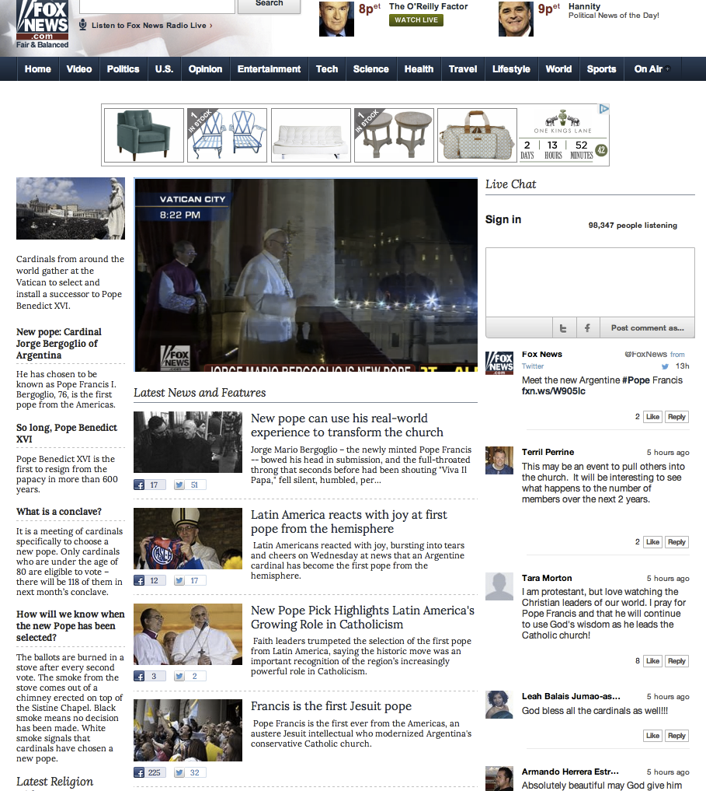

# Chat{#chat}

Abilita la chat in tempo reale sui tuoi siti.

La chat consente al pubblico di partecipare a conversazioni in tempo reale su eventi live, annunci o spettacoli. Il contenuto viene visualizzato come un flusso continuo di chat non thread per facilitare il coinvolgimento rapido e stimolare l&#39;attività sulla pagina.

Fox News ha usato Chat per catturare l&#39;opinione del pubblico e la riflessione intorno all&#39;elezione di Papa Bergoglio. Sapendo che ci sarebbe stato un aumento di partecipazione attiva e rilevante, Fox News ha lanciato una Chat a pochi minuti dall&#39;annuncio per creare una conversazione immediata.

