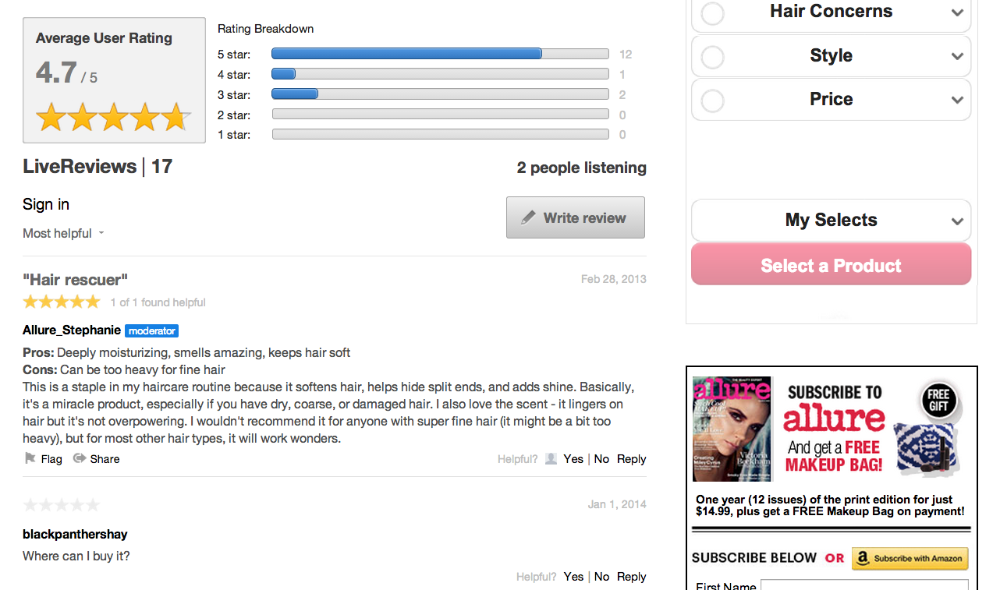

# Recensioni{#reviews}

Valuta e rivedi qualsiasi contenuto del tuo sito web in tempo reale.

Le recensioni consentono agli utenti di valutare e rivedere facilmente prodotti, servizi, articoli o qualsiasi contenuto sul tuo sito web, in tempo reale.

Ogni recensione pubblicata in un&#39;app Revisioni è costituita da una riga Titolo revisione, un corpo e una valutazione numerica. Inserendo un titolo e una valutazione, l’app di revisione quantifica il parere di un utente e fornisce un riepilogo dell’esperienza dell’utente con quel prodotto o servizio.

L&#39;app Revisioni predefinita è costituita da una raccolta di recensioni e una sezione di riepilogo che visualizza la suddivisione Valutazione media utente e Valutazione per la raccolta. Gli utenti possono leggere e interagire con le Revisioni in tempo reale.

Allure utilizza Recensioni per invitare i loro utenti a contribuire valutazioni e opinioni sui prodotti che presentano. Con le recensioni, Allure è in grado di catturare il feedback prezioso e personale degli utenti dal loro pubblico.

## Funzioni recensioni {#section_awq_xph_21b}

Reviews offre diverse funzionalità specifiche per questa app.

* Rappresentazione visiva rapida delle tendenze (classificazioni a stella e riepilogo della valutazione media) sopra il flusso.
* Interfaccia di valutazione personalizzabile, compreso il numero di stelle e la relativa immagine, le sottoparti di valutazione (come Pros e Cons) e più categorie di valutazione.
* Riepiloga le revisioni utilizzando una visualizzazione grafica del rating medio dell&#39;utente e della suddivisione del rating per la raccolta Reviews.
* Visualizza le revisioni in coda, mantenendo la revisione dell’utente nella parte superiore dell’elenco per la relativa visualizzazione.
* Consentire agli utenti di votare sull&#39;utilità delle recensioni, e poi di ordinare in base alla valutazione più utile e/o più alta.
* Interfaccia semplice per dispositivi mobili.
