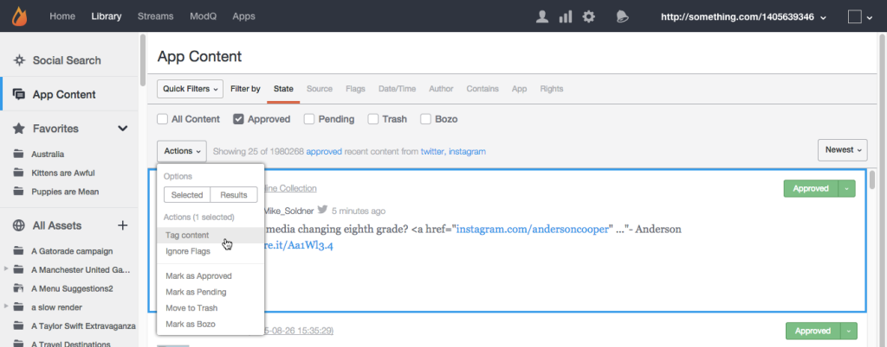

# Moderare il contenuto utilizzando il contenuto dell&#39;app{#moderate-content-using-app-content}

La scheda Contenuto app nella libreria consente di moderare i contenuti pubblicati nelle app.

## Modgola contenuto {#section_md5_sqm_zz}

Utilizzate il pannello Contenuto app per moderare il contenuto elencato, modificandone lo stato, modificando lo stato del suo autore o aggiungendo una nota. Per moderare i contenuti, passate il mouse sul contenuto elencato per cambiare i marcatori disponibili, oppure utilizzate il **[!UICONTROL pulldown]** menu per cambiare lo stato per il contenuto singolo o più selezionato.

Nel contenuto dell&#39;app è possibile:

* **[!UICONTROL Tag Content]**. Seleziona **[!UICONTROL Tag Content]** per aggiungere simultaneamente tag a singole o più parti di contenuto.

* **[!UICONTROL Ignore Flags]**. Selezionate **[!UICONTROL Ignore Flags]** questa opzione per escludere i contenuti selezionati dai risultati del filtro di ricerca segnalati. La selezione **[!UICONTROL Ignore Flags]** di un elemento non ne modificherà lo stato; la rimuove semplicemente dai risultati di ricerca per questo filtro di ricerca, per tutti gli utenti Studio.

* **[!UICONTROL Change Content Status]**. Fate clic su una parte del contenuto, quindi usate il **[!UICONTROL Actions]** menu per modificarne lo stato. (Utilizzate il tasto Comando o Controllo per selezionare più elementi, quindi utilizzate il menu per modificare lo stato per più parti di contenuto simultaneamente.)

   Le opzioni variano a seconda dello stato corrente del contenuto elencato.

   | Stato corrente | Può essere modificato in |
   |---|---|
   | Approvato | Sospeso, Cestino, Bozo |
   | Bozo | Approvato, In sospeso, Cestino |
   | Cestino | Approvato, Sospeso, Bozo, Elimina |
   | In sospeso | Approvato, Cestino, Bozo |

* **[!UICONTROL Save as Assets]**. Selezionate **[!UICONTROL Save as Assets]** questa opzione per aprire la finestra di dialogo Opzioni avanzate, dal quale potete salvare gli elementi selezionati nella Libreria risorse, pubblicarli su un&#39;app o richiedere di riutilizzare i diritti di utilizzo dall&#39;autore.

* Moderazione in base alle raccomandazioni. Utilizzate il **[!UICONTROL Moderation Recommendation Indicator]** contenuto in Contenuti app per filtrare il contenuto che la raccomandazione moderazione identifica con la massima probabilità.

   In Contenuto app, le raccomandazioni di moderazione si presentano come segue: 

## Limita contenuto Sidenotes {#section_i2s_nqm_zz}

L&#39;utilizzo di Sidenotes nel pannello Contenuto comporta diverse operazioni con altri tipi di contenuti:

* Le schede Ulteriori informazioni, Risposte, Flags &amp; Reports e Aggiungi nota non sono disponibili.
* Non potete assegnare tag ai contenuti di Sidenotes, né contrassegnarli come Contenuti.

Inoltre, non solo visualizza il contenuto da moderare. Inoltre, mostra il testo selezionato quando è stato aggiunto Sidenote, consentendo di valutare il contenuto nel contesto.

Fate clic sulla casella di testo per espanderla in modo da includere tutta la virgoletta selezionata dall&#39;utente.

Sidenotes content moderation allows both in bulk changes, and individual status changes, as described above.

## Moderate Livefyre Users {#section_grw_mqm_zz}

Passate il puntatore del mouse sul nome utente di un utente Livefyre per aprire un menu a discesa, consentendo di ottenere **[!UICONTROL Ban the User]**, ottenere **[!UICONTROL More Info]** o visualizzare un elenco di questi **[!UICONTROL Comments]**. Facendo clic su questo menu, viene aperta la scheda Informazioni dell&#39;utente nella **[!UICONTROL Users]** pagina di Studio.

Per ulteriori informazioni su come moderare gli utenti nella **[!UICONTROL Users]** pagina, vedi [Modali modali moderati](/help/using/c-features-livefyre/c-about-moderation/t-moderate-users-modq.md#t_moderate_users_modq).
