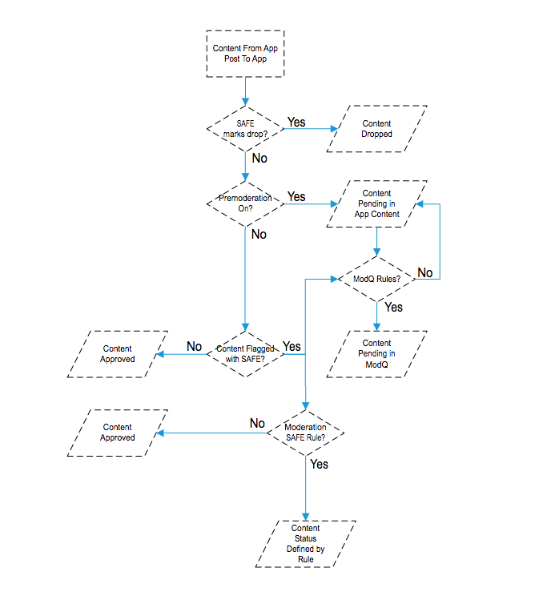
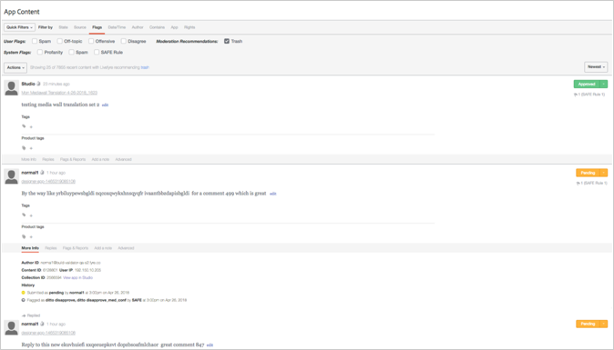

# Impostazione moderazione{#setting-up-moderation}

Utilizzate la scheda Moderazione per impostare regole di premoderazione per i contenuti in arrivo, inclusi elenchi profaschi, regole di flag e indirizzi IP vietati.

## Come funziona moderazione {#section_kyf_gvc_t1b}

Potete moderare il contenuto nei modi seguenti:

* Premoderate automaticamente i contenuti per filtrare il contenuto indesiderato in base alle regole impostate prima di pubblicare il contenuto.
* Eliminate o approvare manualmente i contenuti segnalati mediante la premoderazione automatica mediante la funzione modq o il contenuto dell'app nella libreria.
* Identificare i visitatori del sito che pubblicano ripetutamente contenuti offensivi per evitare di dover pubblicare, vietando utenti di Livefyre, utenti social o indirizzi IP specifici.
* Identificare le persone e il contenuto che possono essere sempre visualizzati mediante la whitelist o la disattivazione dei filtri per flussi, siti o reti specifici.

Potete premoderare automaticamente il contenuto nei modi seguenti:

* Impostate le regole per segnalare automaticamente determinati tipi di contenuto:

   * Impostazione delle regole di segnalazione per il contenuto contrassegnato dai visitatori del sito utilizzando utilizzando **[!UICONTROL Settings > Moderation > Rules]**
   * Configurare regole SAFE utilizzando **[!UICONTROL Settings > Moderation > Rules]**
   * Divieto di utenti Twitter specifici **[!UICONTROL Settings > Streams]**
   * Divieto di indirizzi IP **[!UICONTROL Settings > Bans]**
   * Proibite le aree IP in base al codice del paese per richiesta. Il contenuto proibito verrà contrassegnato come SPAM.

* Create un elenco di parole da utilizzare nell'Elenco profanity per **[!UICONTROL Settings > Moderation > Rules]** la rete o il sito.
* Gli utenti della whitelist (consenti sempre la visualizzazione del contenuto da questi utenti) utilizzano o disattivano i filtri per flussi, siti o reti specifici.

Dopo aver impostato elenchi blasfemici, filtri SAFE e regole, puoi scegliere se premoderare i contenuti e applicare i filtri SAFE nei flussi. Per ulteriori informazioni, consultate [Opzioni regola di flusso per tutte le regole dei flussi](/help/using/c-streams/c-stream-rule-options-for-all-stream-rules.md#c_stream_rule_options_for_all_stream_rules).

Livefyre contrassegna i contenuti come **[!UICONTROL Approved]****[!UICONTROL Pending]****[!UICONTROL Junk]**, ecc. a seconda della provenienza del contenuto, della pubblicazione e delle regole impostate nel sistema. Nella tabella seguente sono descritte le azioni eseguite in Livefyre, in base a tali fattori.

## Come funziona moderazione

| Contenuto da: | Invio di contenuto a: | Stato approvazione |
|--- |--- |--- |
| Libreria | App | Contenuto approvato |
| Ricerca social network | App | Contenuto approvato |
| Regola di flusso | App | Il contenuto è contrassegnato come Ink da filtro SAFE?  <ul><li>No - Flusso di lavoro per moderazione in-app</li><li>Sì - Contenuto trashed</li></ul> |
| Libreria | Cartella | No status (in folder, not published, not trashed) |
| Ricerca social network | Cartella | No status (in folder, not published, not trashed) |
| Regola di flusso | Cartella | Il contenuto è contrassegnato come Ink da filtro SAFE?  <ul><li>No - Nessuno stato (nella cartella, non pubblicato, non con tratto)</li><li>Sì - Contenuto trashed</li></ul> |
| Post app | App | Il contenuto è contrassegnato come Ink da filtro SAFE?  <ul><li>No - Flusso di lavoro di moderazione post-app</li><li>Sì - Contenuto trashed</li></ul> |

## Flusso di lavoro per moderazione in-app {#section_z5z_w4d_t1b}

Prima che il contenuto di un flusso venga pubblicato su un'app, Livefyre esegue i seguenti controlli per determinare cosa fare con il contenuto:

1. Se SAFE contrassegna il contenuto come posta indesiderata o rilascia, Livefyre trasmette il contenuto.
1. Se SAFE non segnala il contenuto come incrinatura, Livefyre verifica se la premoderazione è attivata.
1. Se la premoderazione è attivata, Livefyre contrassegna il contenuto come in sospeso.
1. Se configurate le regole modq, Livefyre invia il contenuto a modq.
1. Se la premoderazione non è attiva, Livefyre verifica se il contenuto è stato segnalato correttamente.
1. Se SAFE ha segnalato il contenuto, Livefyre approva il contenuto e pubblica il contenuto nell'app.
1. Se SAFE contrassegna il contenuto e non hai impostato regole SAFE, Livefyre approva il contenuto e pubblica il contenuto nell'app.
1. Se SAFE contrassegna il contenuto e impostate regole SAFE, Livefyre verifica se configurate regole SAFE per il flusso.
1. Se imposti regole SAFE per il flusso, Livefyre approva il contenuto e pubblica il contenuto nell'app. Se non hai impostato regole SAFE per il flusso, Livefyre usa le regole SAFE moderazione per determinare come gestire il contenuto (inviato a modq, cestino, ecc.).

## Flusso di lavoro di moderazione post-app {#section_fwn_w4d_t1b}

Prima che il contenuto di un post app venga pubblicato su un'app, Livefyre esegue i seguenti controlli per determinare cosa fare con il contenuto:

1. Se il filtro SAFE contrassegna il contenuto come rilascio, Livefyre rilascia il contenuto.
1. Se SAFE non segnala il contenuto come rilascio, Livefyre verifica se la premoderazione è attivata. Se la premoderazione è attivata, Livefyre contrassegna il contenuto come in sospeso. Se configurate le regole modq, Livefyre invia il contenuto a modq come sospeso. In caso contrario, il contenuto rimane in sospeso in Contenuto app nella libreria.
1. Se la premoderazione non è attiva, Livefyre verifica se il contenuto è stato segnalato correttamente. In caso contrario Livefyre approva il contenuto e pubblica il contenuto nell'app.
1. Se SAFE contrassegna il contenuto e configurate regole SAFE, Livefyre usa la regola SAFE per determinare come gestire il contenuto (inviato a modq, cestino, ecc.). Se SAFE contrassegna il contenuto e non hai impostato regole SAFE, Livefyre approva il contenuto e pubblica il contenuto nell'app.

## Filtri in massa {#section_lyk_ktx_vy}

Il filtro in blocco cerca contenuti ripetitivi pubblicati in tutte le reti Livefyre entro un breve intervallo di tempo. Se rilevato, questo contenuto viene contrassegnato come In blocco e quindi ritagliato per impostazione predefinita. Mentre il contenuto in massa può essere generato dall'utente (ad esempio «Touchdown». »» viene pubblicata ripetutamente in una chat durante un gioco di calcio più diffuso), la maggior parte dei quali è dotata di campagne spam. Questo filtro è indipendente dalla lingua e funziona con qualsiasi lingua. Per personalizzare il filtro in blocco, contattate il supporto Livefyre.

## Regole {#section_gqz_ksk_f1b}

Utilizza la sezione Regole per creare regole di premoderazione basate su SAFE e su quelli applicati dall'utente. Questo pannello offre due tipi di regole:

* **[!UICONTROL Flag Rules:]** specificare un'azione che deve essere eseguita su un commento segnalata dagli utenti un numero di volte definito.
* ****[!UICONTROL SAFE Rules:]combinare flag SAFE con azioni da utilizzare per il contenuto contrassegnato.

Per creare regole di segnalazione, selezionate il flag (Offensivo, Non d'accordo, Non d'accordo o Spam), immettete il numero di volte che deve essere applicato a una parte del contenuto e selezionate l'azione da intraprendere. Potete impostare una Regola di flag per ogni opzione di flag (Offensiva, Fuori argomento, Non d'accordo o Spam).

Potete creare regole a livello di rete, sito e flusso. Le regole a livello di sito ereditano le regole di rete, a meno che tu non configura le regole del sito in modo diverso. Le regole del flusso ereditano le regole del sito a meno che non siano configurate in modo diverso.

Azioni disponibili:

* ****[!UICONTROL Trash it:]invia il commento contrassegnato al cestino.
* **[!UICONTROL Bozo it:]** nasconde il commento segnalato da tutti gli utenti, tranne il relativo scrittore, a cui resta visibile.
* **[!UICONTROL Pending:]** imposta il contenuto in sospeso. Se impostate Premoderazione su Attivato, **[!UICONTROL Settings > ModQ]**questo si troverà in modq. In caso contrario, sarà disponibile solo in Contenuto app.

>[!NOTE]
>
>Livefyre consiglia di creare regole ai commenti Bozo segnalati come Spam o Offensivi da cinque utenti.

## Raccomandazioni moderazione {#section_ec3_vr3_2cb}

Potete utilizzare raccomandazioni di moderazione per determinare come moderare i contenuti pubblicati dai visitatori del sito in Livefyre Apps. L'indicatore raccomandazione moderazione consiglia quando è probabile che una parte del contenuto venga scaricata, in base alle azioni eseguite in precedenza su contenuti simili. Per utilizzare Recommendations moderazione:

1. Attivate la funzionalità di Moderazione di Moderazione contattando il vostro tecnico di supporto Adobe Livefyre.
1. Configurare raccomandazioni di moderazione in Impostazioni di rete.

   Configurate le raccomandazioni di moderazione utilizzando l' **[!UICONTROL Livefyre Recommends Trash]** impostazione sotto **[!UICONTROL Network Settings]**.

   

1. Configurate una regola SAFE per indicare a Livefyre cosa fare con il contenuto identificato dalla raccomandazione moderazione come contenuto che sarà probabilmente sottoposto a tradimento. Per ulteriori informazioni su come impostare una regola SAFE per l' **[!UICONTROL Livefyre Recommends Trash]** opzione, vedi [Moderazione](/help/using/c-features-livefyre/c-about-moderation/c-moderation.md#c_moderation).

   

1. Utilizzate il **[!UICONTROL Moderation Recommendation Indicator]** metodo modq o in Content Content (Contenuto app) per filtrare il contenuto che la raccomandazione moderazione identifica con la massima probabilità.

   In modq, l'indicatore ha l'aspetto seguente: 

   Per ulteriori informazioni su come utilizzare Recommendations Recommendations (Raccomandazioni moderazione) per moderare il contenuto in modq, vedere [modq](/help/using/c-features-livefyre/c-about-moderation/c-modq.md#c_modq).

   In Contenuto app, le raccomandazioni di moderazione si presentano come segue: 

   Per ulteriori informazioni su come utilizzare Recommendations Recommendations (Raccomandazioni moderazione) in Content Content (Contenuto app), vedi [Moderare il contenuto mediante il contenuto dell'app](/help/using/c-features-livefyre/c-about-moderation/c-moderate-content-using-app-content.md#c_moderate_content_using_app_content).
