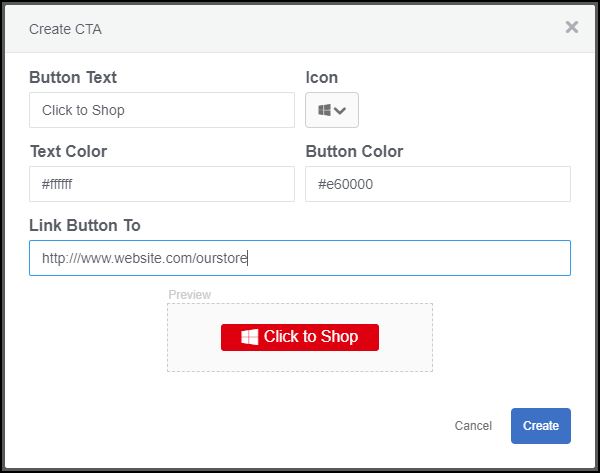

# Pulsante Invito all'azione personalizzato{#custom-call-to-action-button}

## Pulsante Invito all'azione personalizzato {#topic_EBE23A0F827645E0A0C619DCF3872EE5}

I pulsanti Custom Call-To-Action (CTA, Call Call-To-Action) sono pulsanti che possono essere aggiunti a qualsiasi risorsa in Livefyre Studio. Possono indirizzare un utente finale a qualsiasi URL personalizzato, ad esempio una pagina social media o un carrello. I pulsanti CTA possono essere creati in più posizioni in Livefyre, ma sono gestiti nella **[!UICONTROL Settings]** sezione di Livefyre Studio.

Con i ctas personalizzati, puoi:

* Aggiungete pulsanti CTA personalizzati a qualsiasi elemento UGC nei pareti multimediali, mosaici, caroselli, strisce cinematografiche e schede di singole funzionalità di Livefyre.
* Controlla il messaggio, le icone, i colori, i collegamenti e il numero di pulsanti su ciascun elemento UGC.
* Create, gestite e riutilizzate pulsanti CTA personalizzati dall'interno delle Impostazioni e della libreria.
* Utilizza Adobe Analytics per misurare i tassi di click-through.

## Creare un pulsante di invito personalizzato {#task_C61B4A8E66F24AC19C833612E596B736}

Contesto attività

1. In Livefyre Studio, fate clic **[!UICONTROL Settings]**su.
1. Nella barra a sinistra, fate clic **[!UICONTROL CTAs]**su.

   Viene visualizzata la libreria CTA, in cui le CTAS possono essere create e organizzate all'interno delle cartelle. 1. Fate clic **[!UICONTROL Create CTA]**su.
1. Completate i campi con le personalizzazioni desiderate e l'anteprima di un pulsante viene visualizzata nella parte inferiore della schermata Crea CTA.

   

1. Fate clic **[!UICONTROL Create]**su.

   Il pulsante CTA è ora disponibile per essere aggiunto a qualsiasi risorsa.

## Aggiungere un pulsante Invito personalizzato a una risorsa {#task_36190DD1C8204C7793CB7EEA379C2155}

Aggiungete un pulsante CTA a qualsiasi contenuto in Livefyre Studio.

1. Nel studio Livefyre, andate a **[!UICONTROL Library]** > **[!UICONTROL All Assets]**.
1. Selezionate una o più risorse in cui aggiungere un pulsante CTA.
1. Fate clic **[!UICONTROL CTAs]**su.

   

1. Selezionate il pulsante CTA desiderato dall'elenco, quindi fate clic **[!UICONTROL Add]**su.

   Il pulsante CTA viene ora visualizzato sulla risorsa selezionata.

   >[!NOTE]
   >
   >Per le ctas personalizzate associate a ciascuna risorsa da visualizzare in un'app, è necessario abilitare i pulsanti CTA nelle impostazioni app:
   >
   >
