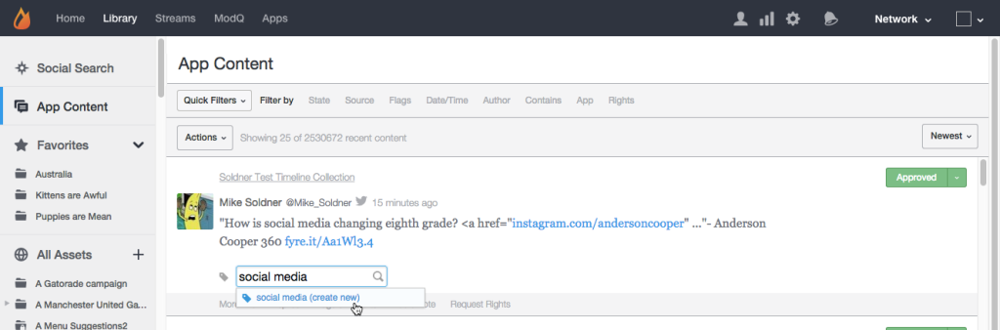

# Scheda Contenuto app{#app-content-tab}

Gestione dei contenuti nella rete Livefyre.

La scheda Contenuto app nella libreria ti consente di cercare e moderare il contenuto pubblicato nelle app. La **[!UICONTROL App Content]** consente di attivare diversi filtri di ricerca con ricerca con caratteri jolly, per definire in modo più rapido e semplice i parametri di ricerca.

Utilizza la scheda Contenuto app per:

* Ricerca di contenuti
* Visualizza cronologia dei contenuti
* Contenuto moderato
* Aggiungi un tag
* Contenuto della funzione
* Associa contenuto ai prodotti del catalogo prodotti

Per ulteriori informazioni su come moderare il contenuto utilizzando la scheda Contenuto app , consulta [Contenuto moderato utilizzando la scheda Contenuto app](../c-features-livefyre/c-about-moderation/c-moderate-content-using-app-content.md#c_moderate_content_using_app_content).

## Ricerca con caratteri jolly {#section_jvr_ntm_zz}

I campi di ricerca Livefyre supportano i caratteri jolly, che consentono di aggiungere un asterisco ( * ) alle parole (o frammenti di parole) per rilevare le corrispondenze parziali.

Ad esempio:

* la palla restituisce solo la palla
* palla* restituisce pallone e pallone
* *la palla restituisce la palla e il calcio
* *la palla* restituisce la sfera e l&#39;uniball e la snowballato

## Ricerca di contenuti {#section_fw1_mtm_zz}

Il pannello Contenuto app consente di restringere la ricerca utilizzando diverse opzioni di filtro del contenuto.

Utilizza la **[!UICONTROL Quick Filters]** a discesa per limitare il contenuto restituito a **[!UICONTROL All Content]**, **[!UICONTROL All Sidenotes]**, **[!UICONTROL Approved]**, **[!UICONTROL Approved & Flagged]**, **[!UICONTROL Pending]** oppure **[!UICONTROL Rights Requests]** stato. Quindi seleziona una **[!UICONTROL Filter by]** e utilizza le caselle di controllo o i campi di input disponibili per limitare la ricerca.

Utilizza il menu a discesa per ordinare il contenuto dell’elenco in base a **[!UICONTROL Newest]**, **[!UICONTROL Oldest]**, **[!UICONTROL Recently updated]**, **[!UICONTROL Most flags]** o **[!UICONTROL Most liked]**.

## Filtra per opzioni {#section_aqn_xqm_zz}

Utilizza la **[!UICONTROL Filter by]** per filtrare in base alle seguenti opzioni:

* **Stato** Consente di filtrare in base allo stato di moderazione corrente del contenuto:** [!UICONTROL All Content]**, **[!UICONTROL Approved]**, **[!UICONTROL Pending]** oppure **[!UICONTROL Bozo]**.

* **Origine** Consente di filtrare in base all’origine del contenuto. Seleziona **[!UICONTROL Livefyre]** per elencare i contenuti generati dagli utenti pubblicati direttamente nel flusso. Seleziona **[!UICONTROL Facebook]**, **[!UICONTROL Twitter]** oppure **[!UICONTROL RSS]** per includere il contenuto estratto nelle app da tali origini.

* **Flag** La selezione dei flag consente di filtrare in base a **[!UICONTROL User Flags]** (Spam, Off-topic, Offensive o in disaccordo), **[!UICONTROL System Flags]** applicati da SAFE (Profanity, Spam o Magically Moderated), oppure **[!UICONTROL Moderation Recommendations]**. 

* **Data/ora** Consente di filtrare per quando il contenuto era originariamente **[!UICONTROL Created]** (o nell&#39;app tramite SocialSync o un Stream), o l&#39;ultima **[!UICONTROL Modified]** (modificato, contrassegnato o modificato lo stato).

* **Autore** Consente di filtrare in base all’ **[!UICONTROL IP]** indirizzo, **[!UICONTROL Display Name]** (si trova nel pannello Utenti o dal di sopra al contenuto pubblicato dall&#39;autore), oppure **[!UICONTROL User ID]**(nel pannello Utenti ).

* **Contiene** Consente di filtrare i contenuti degli ultimi 90 giorni per **[!UICONTROL Keyword]** o **[!UICONTROL Content Tag]**. Seleziona la **[!UICONTROL Media]** per restituire solo il contenuto contenente Media. (Per cercare tutto il contenuto, scorri verso il basso tutto il contenuto dell’elenco, quindi fai clic su **[!UICONTROL Search full data]**.)

   **Nota:** La ricerca di più parole chiave e tag di contenuto non è supportata. Se vengono inseriti più parole chiave o tag, l’ultima parola verrà utilizzata per la ricerca.

   Durante la ricerca per Tag contenuto, i tag suggeriti verranno compilati automaticamente mentre digiti nel campo di ricerca. I risultati della ricerca restituiranno tutto il contenuto a cui è stato assegnato il tag . (Usa questo campo per cercare il contenuto in primo piano o fai clic sul pulsante **[!UICONTROL Featured]** su qualsiasi contenuto disponibile in Studio.)

   **Nota:** Usa un segno meno (-) prima del nome di un tag per cercare contenuti che non lo includono. Ad esempio: Cerca &quot;-Miley&quot; per cercare tutti i contenuti che non includono il tag &quot;Miley&quot;.

* **App** Consente di filtrare per **[!UICONTROL Collection ID]**, **[!UICONTROL App Tag]** oppure **ID padre**. L’applicazione di filtri per ID padre restituisce tutti i contenuti che rappresentano una risposta all’ID contenuto di input. Per filtrare in base a più tag, immetti i tag separati da una virgola.

* **Diritti** Consente di filtrare in base allo stato delle richieste di diritti:** [!UICONTROL Requested]**, **[!UICONTROL Granted]**, **[!UICONTROL Replied]** oppure **[!UICONTROL Expired]**.

## Contenuto Bozo {#section_afl_vqm_zz}

Nelle App, **[!UICONTROL Bozo]** il contenuto viene visualizzato solo dall’autore del contenuto. Questo consente all’utente di credere che il proprio contenuto sia stato approvato, nascondendolo dagli altri utenti e moderatori.

>[!NOTE]
>
>Contenuto social proveniente da SocialSync o Streams **[!UICONTROL cannot]** essere impostato su Bozo.

Puoi creare contenuti Bozo per i seguenti motivi:

* Il contenuto identificato come Spam da SAFE viene automaticamente impostato sullo stato Bozo.
* Tutti i contenuti di Utenti banditi vengono automaticamente impostati su Bozo.
* Il contenuto può essere contrassegnato come Bozo da Studio.
* I moderatori possono creare contenuti Bozo direttamente nel flusso.

## Visualizza cronologia dei contenuti {#section_ayz_tqm_zz}

Il pannello dei contenuti ti consente di esaminare la cronologia di tutti i contenuti elencati, inclusi la moderazione, il filtraggio dello spam, la data del post e tutti i flag o le note utente assegnati all’elemento.

Utilizza le schede nella parte inferiore del pannello dei contenuti per visualizzarne la cronologia.

* **[!UICONTROL More Info:]** elenca tutte le attività relative a questo contenuto, inclusi l’invio, la modifica, il controllo dello spam, la modifica dello stato e le note. In questa sezione vengono visualizzati anche l’ID contenuto Livefyre e l’indirizzo IP dell’utente.
* **[!UICONTROL Replies:]** elenca un massimo di 6 risposte. Fai clic su **[!UICONTROL Show all replies]** per visualizzare tutte le risposte al post.

* **[!UICONTROL Flags & Reports:]** elenca tutti i flag utente, con l’avatar dell’utente che ha segnalato il contenuto e tutti i report (note aggiunte dall’utente durante l’aggiunta di un flag al contenuto).
* **[!UICONTROL Add a note:]** consente di aggiungere una nota visibile ad altri amministratori o moderatori.
* **[!UICONTROL Request Rights:]** apre **[!UICONTROL New Rights Request]** dialogo, da cui può essere presentata una richiesta di diritti.

* **[!UICONTROL Save as Asset:]**apre la **[!UICONTROL Advanced Options]** , che consente di salvare l’elemento selezionato nella libreria delle risorse, di pubblicarlo in un’app o di richiedere i diritti di riutilizzo all’autore.

## Aggiungere un tag al contenuto {#section_xb4_mxr_rdb}

L’assegnazione tag ai contenuti consente di organizzare e classificare i contenuti per facilitarne il recupero e la personalizzazione degli stili, oppure di contrassegnare i contenuti come descritto.

Per aggiungere tag, fai clic sul segno più ( **[!UICONTROL +]**) sotto il contenuto. Inserisci un nuovo tag o selezionalo da un elenco di tag esistenti.

## Ricerca di immagini in tutte le risorse {#section_zxf_hsf_wcb}

Dopo aver aggiunto il contenuto alla libreria, puoi eseguire ricerche nel contenuto mediante tag avanzati.

Nella sezione Tutte le risorse della libreria, puoi cercare le immagini esistenti facendo clic su **[!UICONTROL Show Filters]** e quindi:

* Inserimento di testo da cercare nel campo di ricerca
* Ordinamento in base alla pertinenza
* Inserimento di testo nel **[!UICONTROL Tags]** campo da cercare per tag avanzati. L’algoritmo di classificazione dei tag avanzati filtra il contenuto utilizzando un punteggio di affidabilità per tag avanzati, la novità del contenuto e quante stelle un utente ha dato il contenuto.

## Contenuto in primo piano {#section_emb_kqm_zz}

Seleziona il valore predefinito **[!UICONTROL Featured]** contrassegna il contenuto come in primo piano ed evidenzialo come importante per i tuoi utenti. Una volta assegnati i tag, utilizza le opzioni di stile personalizzate per personalizzare il contenuto in primo piano nelle app.

## Per Feature o annullare la funzione del contenuto {#section_ojx_3qm_zz}

* Da Studio, fai clic sul pulsante **[!UICONTROL +]** firma accanto a una parte di contenuto, seleziona **[!UICONTROL Featured]** nell’elenco a discesa e fai clic su **[!UICONTROL Enter]** per Feature content. Il tag viene salvato e visualizzato accanto al contenuto.

* Per annullare la funzione, fai clic sul pulsante **[!UICONTROL x]** sulla **[!UICONTROL Featured]** sul contenuto.

* Dall&#39;interno di un&#39;app Commenti, Blog live o Recensioni, passa il puntatore del mouse sul contenuto che desideri visualizzare e fai clic su **[!UICONTROL Feature]**. Per annullare la funzione, passa il mouse sul contenuto e fai clic su **[!UICONTROL Unfeature]**.

>[!NOTE]
>
>A causa di vincoli di spazio, il contenuto della chat può essere disponibile solo in studio o non essere disponibile utilizzando Studio e potrebbe non essere disponibile dall&#39;interno dell&#39;app stessa.

## Modifica del contenuto in primo piano {#section_pyw_hqm_zz}

La maggior parte delle azioni regolari sui contenuti possono essere eseguite sui contenuti in primo piano, ad eccezione dei seguenti:

* Il contenuto in primo piano non può essere contrassegnato.
* Gli utenti non possono modificare il proprio contenuto dopo che è stato pubblicato, anche se possono comunque eliminarlo se lo desiderano. I moderatori possono modificare il contenuto in primo piano.
