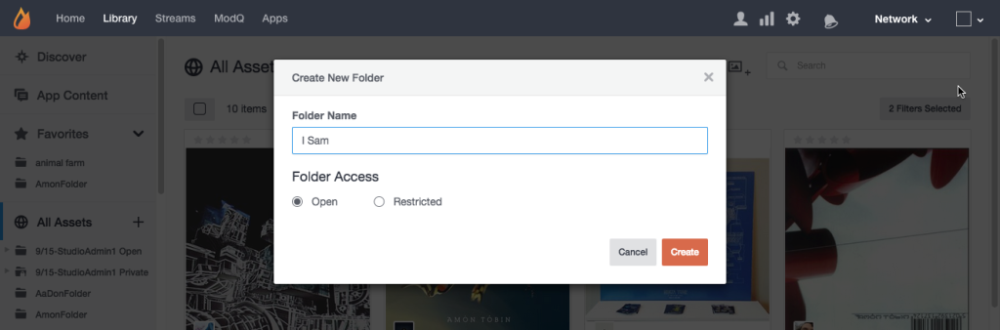

# Creare le cartelle di risorse{#create-asset-folders}

Creare cartelle per organizzare le risorse.

La creazione di una nuova cartella consente di aggiungerla all'elenco Tutte le risorse in ordine alfabetico. Per aggiungere una sottocartella, selezionate prima la cartella in cui si troverà, quindi fate clic sull' **[!UICONTROL Create New Subfolder]** icona nella parte superiore della pagina.

1. Fai clic sulla **[!UICONTROL Create new folder]** vista ad albero, immetti un nome e fai clic su **[!UICONTROL Create]** per creare la cartella al livello principale di Tutte le risorse.
1. Selezionate una cartella, quindi fate clic sull' **[!UICONTROL Create New Subfolder]** icona nella parte superiore della pagina per aggiungere una sottocartella.
1. Create una nuova cartella quando aggiungete contenuti alla Libreria risorse dalla **[!UICONTROL Add to folder > Select folder]** finestra di dialogo.
