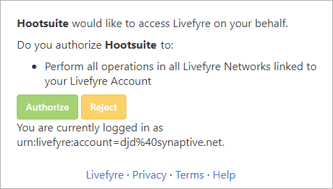
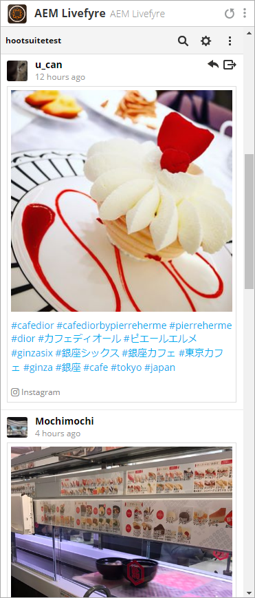
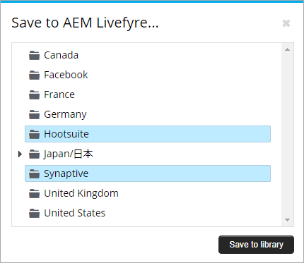
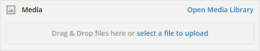
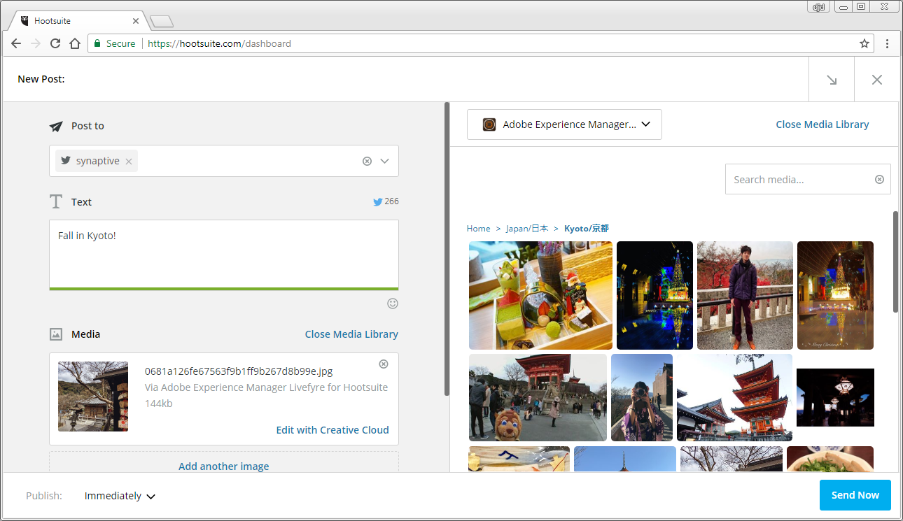

# Utilizzare Adobe Experience Manager Livefyre con Hootsuite{#use-adobe-experience-manager-livefyre-with-hootsuite}

Scoprite come utilizzare Experience Manager Livefyre con Hootsuite per curare, gestire e condividere contenuti generati dall&#39;utente direttamente dal dashboard di Hootsuite.

## Utilizzare Adobe Experience Manager Livefyre con Hootsuite {#topic_FB6E613DBCF74F39ABD5045C501EA326}

Scoprite come utilizzare Experience Manager Livefyre con Hootsuite per curare, gestire e condividere contenuti generati dall&#39;utente direttamente dal dashboard di Hootsuite.

## Introduzione {#task_22699BD901C24384AB2DC02D926D8F4A}

Contesto attività

1. Installate Adobe Experience Manager Livefyre per Hootsuite dalla directory Hootsuite App Directory.

1. Dal dashboard di Hootsuite, fate clic **su Accesso con Adobe**.

   

1. Accedete a Experience Manager Livefyre utilizzando le credenziali di Livefyre.
1. Fate clic **su Autorizza** per autorizzare le librerie ad Hootsuite.

   

   Dopo aver concesso l&#39;autorizzazione, tornerete al dashboard di Hootsuite dove potrete cercare le risorse nelle librerie Experience Manager Livefyre.

## Cercare risorse {#task_0B011B0C539E400BB72A6DF69FBF66C0}

Contesto attività

1. Fate clic sull&#39;icona di ricerca nella barra dei menu per cercare le risorse nelle librerie Experience Manager Livefyre.

   

1. Fai clic **su Seleziona** e viene visualizzata una finestra a comparsa con tutte le librerie.
1. Fate clic sulla cartella di una libreria, quindi fate clic **su Seleziona cartella** per selezionare la libreria che verrà visualizzata nel flusso di Hootsuite.

   

## Opzioni filtro {#concept_5D062A9CD61A4B2E90784E5AA31CB16D}

Potete filtrare i risultati della ricerca utilizzando le sezioni Visualizza risorse da, Diritti, Parole chiave e Tag.

Le opzioni di filtro includono:

| Sezione | Descrizione |
|--- |--- |
| Visualizza risorse da | Selezionate questa opzione per visualizzare le risorse da Tutte le sorgenti o da una singola sorgente. Ad esempio: Instagram, Twitter, Facebook, ecc. |
| Diritti | Selezionate questa opzione per visualizzare solo le risorse con un&#39;impostazione diritti specifica. |
| Parole chiave | Selezionare per filtrare i risultati per parole chiave o tag. Il filtro per parole chiave consente di eseguire ricerche nel contenuto di testo di un post, nonché nel nome visualizzato dell&#39;autore e nell&#39;autore del nome utente. |
| Tag | Selezionare per filtrare i risultati per parole chiave o tag. Il filtro per parole chiave consente di eseguire ricerche nel contenuto di testo di un post, nonché nel nome visualizzato dell&#39;autore e nell&#39;autore del nome utente. |

Dopo aver selezionato i parametri di ricerca, quando effettui ricerche le risorse verranno visualizzate in streaming:

### Opzioni menu Flusso

Facendo clic sul nome o sull&#39;icona dell&#39;utente viene visualizzato l&#39;utente nella rispettiva rete. Facendo clic sull&#39;ora viene visualizzato l&#39;articolo originale. Quando il mouse si trova sopra l&#39;elemento, vengono visualizzate più opzioni. Fate clic sul pulsante Condividi 

aggiungerà la risorsa corrente alla casella di composizione di rete, che consente di condividerla con le reti tramite Hootsuite.

>[!NOTE]
>
>Il pulsante Condividi verrà visualizzato solo quando si filtrano le risorse con diritti concessi.

Fate clic sull&#39;icona Assegna  per assegnare l&#39;elemento corrente a uno dei membri del team di Hootsuite. Se un elemento è già stato assegnato, viene risolto il pulsante 

viene visualizzata. Fate clic su di essa per risolvere l&#39;assegnazione corrente.

### Altri menu app

Fate clic sulle impostazioni 

vi consentirà di disconnettere l&#39;account Experience Manager Livefyre corrente e di connettervi a un altro.

Fare clic sul menu 

per visualizzare i collegamenti per il documento, il supporto e il sito Web di Synaptive.

## Plug-in App Manager Livefyre {#task_33C8CEF4F5E44830B970BB3A7AAA2AA6}

Oltre a essere in grado di visualizzare le librerie di risorse in un flusso Hootsuite, potete anche salvare gli elementi da flussi di immagini, Twitter, Facebook e YouTube nelle librerie Experience Manager Livefyre.

1. Fate clic sull&#39;icona Menu nella parte inferiore di ogni elemento.

   

1. Selezionate **Invia ad AEM Livefyre**.
1. Selezionate una o più librerie in cui salvare la risorsa.

   

1. Fate clic **su Salva nella libreria** e l&#39;elemento verrà salvato nelle librerie selezionate.

## Componente Libreria multimediale di Experience Manager Livefyre {#task_9CA2D5D49F8E463F9EF475BC09C8ACC9}

Potete accedere alle risorse tramite i componenti multimediali di Hootsuite Composer.

1. Dal Composer, fate clic sul collegamento **Apri libreria** Media nella sezione **File multimediali** .

   

1. Selezionate Adobe Experience Manager Livefyre dal menu a discesa e i vostri file verranno visualizzati.

   

1. Per aggiungere una risorsa al post corrente che state scrivendo, fate clic su di essa. Per cercare una risorsa specifica, immettete i termini di ricerca nella casella **Ricerca file multimediali** e i risultati verranno visualizzati.
