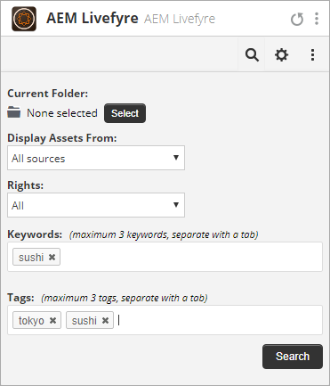

# Utilizzo di Adobe Experience Manager Livefyre con Hootsuite{#use-adobe-experience-manager-livefyre-with-hootsuite}

Scoprite come utilizzare  Experience Manager Livefyre con Hootsuite, per curare, gestire e condividere contenuti generati dagli utenti direttamente dal dashboard di Hootsuite.

## Utilizzo di Adobe Experience Manager Livefyre con Hootsuite {#topic_FB6E613DBCF74F39ABD5045C501EA326}

Scoprite come utilizzare  Experience Manager Livefyre con Hootsuite, per curare, gestire e condividere contenuti generati dagli utenti direttamente dal dashboard di Hootsuite.

## Introduzione {#task_22699BD901C24384AB2DC02D926D8F4A}

Contesto attività

1. Installate Adobe Experience Manager Livefyre per Hootsuite dalla directory delle app di Hootsuite.

1. Dal dashboard di Hootsuite, fare clic su **Accedi con  Adobe**.

   

1. Accedete  Experience Manager Livefyre utilizzando le credenziali Livefyre.
1. Fate clic su **Autorizza** per concedere a Hootsuite l&#39;autorizzazione per accedere alle librerie.

   

   Una volta concessa l’autorizzazione, verrete riportati nella dashboard di Hootsuite in cui potete cercare le risorse nelle librerie Livefyre  Experience Manager.

## Cercare risorse {#task_0B011B0C539E400BB72A6DF69FBF66C0}

Contesto attività

1. Fate clic sull&#39;icona di ricerca nella barra dei menu per cercare le risorse nelle librerie Livefyre  Experience Manager.

   

1. Fare clic su **Seleziona** per visualizzare una finestra a comparsa con tutte le librerie.
1. Fate clic sulla cartella di una libreria, quindi fate clic su **Seleziona cartella** per selezionare la libreria che verrà visualizzata nel flusso di hootsuite.

   

## Opzioni filtro {#concept_5D062A9CD61A4B2E90784E5AA31CB16D}

Potete filtrare i risultati di ricerca utilizzando le sezioni Visualizza risorse da, Diritti, Parole chiave e Tag.

Le opzioni di filtro includono:

| Sezione | Descrizione |
|--- |--- |
| Visualizza risorse da | Selezionate questa opzione per visualizzare le risorse da Tutte le origini o da una singola origine. Ad esempio: Instagram, Twitter, Facebook, ecc. |
| Rights | Selezionate questa opzione per visualizzare solo le risorse con un’impostazione specifica per i diritti. |
| Parole chiave | Selezionate questa opzione per filtrare i risultati in base a Parole chiave o Tag. Il filtraggio per parole chiave consente di cercare il contenuto di testo di un post, nonché il nome visualizzato dell’autore e il nome utente dell’autore. |
| Tag | Selezionate questa opzione per filtrare i risultati in base a Parole chiave o Tag. Il filtraggio per parole chiave consente di cercare il contenuto di testo di un post, nonché il nome visualizzato dell’autore e il nome utente dell’autore. |

Dopo aver selezionato i parametri di ricerca, le risorse verranno visualizzate in streaming durante la ricerca:

### Opzioni del menu Flusso

Facendo clic sul nome o sull&#39;icona dell&#39;utente, l&#39;utente verrà visualizzato sulla rete corrispondente. Facendo clic sull&#39;ora viene visualizzato l&#39;articolo originale. Quando il mouse si trova sopra l&#39;elemento, vengono visualizzate ulteriori opzioni. Fare clic su Condividi 

Questa icona aggiunge la risorsa corrente alla casella di composizione della rete, consentendovi di condividerla con le reti tramite Hootsuite.

>[!NOTE]
>
>Il pulsante Condividi viene visualizzato solo quando filtrate risorse con diritti concessi.

Fate clic sull&#39;icona Assegna  per assegnare l&#39;elemento corrente a uno dei membri del team di Hootsuite. Se un elemento è già stato assegnato, la risoluzione 

apparirà un&#39;icona. Fare clic su di esso per risolvere l&#39;assegnazione corrente.

### Altri menu dell&#39;app

Fare clic su Impostazioni 

L&#39;icona consentirà di scollegare l&#39;account Livefyre del Experience Manager corrente e di connettersi con un altro account.

Fare clic sul menu 

verranno visualizzati i collegamenti per il documento, il supporto e il sito Web di Synaptive.

##  plug-in app Livefyre Experience Manager {#task_33C8CEF4F5E44830B970BB3A7AAA2AA6}

Oltre a poter visualizzare le librerie di risorse in un flusso Hootsuite, potete anche salvare gli elementi dai flussi Instagram, Twitter, Facebook e YouTube nelle librerie Livefyre  Experience Manager.

1. Fate clic sull&#39;icona Menu presente nella parte inferiore di ogni elemento.

   

1. Selezionare **Invia a AEM Livefyre**.
1. Selezionate una o più librerie in cui salvare la risorsa.

   

1. Fare clic su **Salva nella libreria** e l&#39;elemento verrà salvato nelle librerie selezionate.

##  componente Libreria multimediale Livefyre {#task_9CA2D5D49F8E463F9EF475BC09C8ACC9}

Potete accedere alle risorse tramite i componenti multimediali di Hootsuite Composer.

1. In Composer, fate clic sul collegamento **Apri libreria multimediale** nella sezione **File multimediali**.

   

1. Selezionate Adobe Experience Manager Livefyre dal menu a discesa e i file verranno visualizzati.

   

1. Per aggiungere una risorsa al post corrente in corso di scrittura, fate clic su di esso. Per cercare una risorsa specifica, immettete i termini di ricerca nella casella **Search Media** e verranno visualizzati i risultati.
