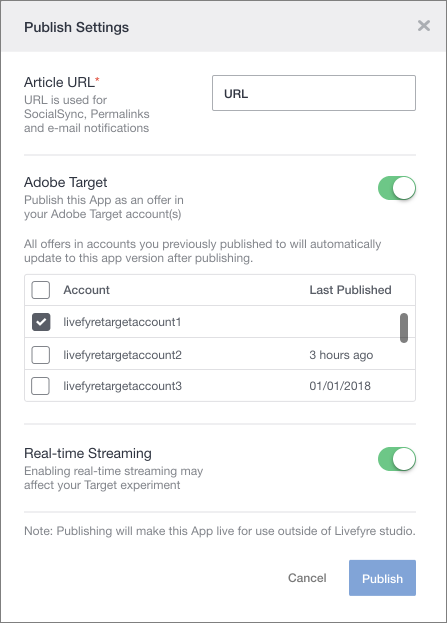

# Utilizzo di Adobe Experience Manager Livefyre con Adobe Target {#livefyre-target}

L'integrazione di Livefyre con Adobe Target consente di condividere le app Livefyre direttamente in Target Offers Library.

## Connect un'istanza di Livefyre con Target {#connect-livefyre-target}

Collegate un'istanza di Livefyre ad Adobe Target collegando il vostro account Adobe IMS nelle impostazioni utente.

1. In Livefyre Studio, fate clic sulla **[!UICONTROL Users]** scheda.

1. Selezionate l'account utente che desiderate connettere a Target mediante l'integrazione con l'account IMS.

1. Fate clic **[!UICONTROL Connect]**su.

1. Immettete le credenziali IMS.

Le istanze di prodotto che il tuo account Adobe IMS dispone dell'accesso possono essere visualizzate nella finestra Integrazione IMS di Adobe.

L'istanza Livefyre è ora collegata ad Adobe Target.

## Condivisione di un'app Livefyre con Adobe Target {#share-livefyre-target}

Condividere un'app creata in Livefyre Studio direttamente con Adobe Target.

1. In Livefyre Studio, fate clic sulla **[!UICONTROL Apps]** scheda.

1. Selezionate l'app da condividere in Adobe Target.

1. Fate clic **[!UICONTROL Publish]**su.

1. In Impostazioni pubblicazione, fate clic sul switch Adobe Target.

Viene visualizzato un elenco di Istanze di Target.

1. Selezionate l'istanza Target in cui desiderate condividere l'app.

1. Fate clic **[!UICONTROL Publish]**su.

L'app Livefyre è ora disponibile per l'utilizzo in Target Offers Library. Per ulteriori informazioni sulla pubblicazione di app, consulta [Pubblica contenuto](/help/using/c-library/t-publish-content.md) e [offerte](https://marketing.adobe.com/resources/help/en_US/target/target/c_manage_content.html) nella documentazione di Target.