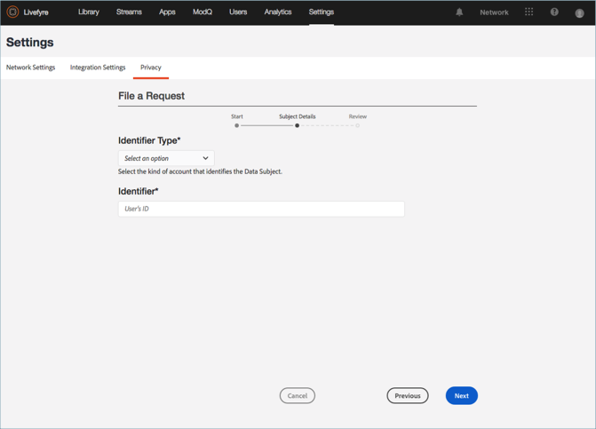

# Creare una richiesta privacy{#create-a-privacy-request}

Create una richiesta sulla privacy in Livefyre.

Eliminare tutti i dati di un utente, generare un rapporto di tutti i dati per un utente e apportare modifiche di consenso o rinuncia utilizzando questo processo.

Per cercare e trovare un utente e generare un rapporto sui contenuti:

1. Vai a **[!UICONTROL Settings > Privacy]**, quindi fai clic **[!UICONTROL Create Request]** su.

   

1. Compila le informazioni nella **[!UICONTROL Submit Request]** finestra:

   * **[!UICONTROL Reference Id]**. Inserite un identificatore da utilizzare per riferimento futuro. Ad esempio, potete aggiungere testo, un numero di ticket, un URL, un indirizzo e-mail o un&#39;altra stringa composta da un massimo di 255 caratteri
   * **[!UICONTROL Type]**

      * **Accesso**. Raccoglie tutti i dati disponibili associati all&#39;account. I dettagli riservati, ad esempio password o credenziali social, saranno offuscati o omessi.

      * **Elimina**. Celona o nasconde tutti i dati associati all&#39;account. **Se scegliete questa opzione e fate clic su Invia, non potete invertire o annullare questa azione,*né recuperare i dati eliminati.*** Se l&#39;account appartiene a un utente Livefyre Studio, alcuni dati saranno conservati per mantenere l&#39;integrità dei record aziendali.

         >[!IMPORTANT]
         >
         >L&#39;eliminazione dei dati per un account comporta l&#39;eliminazione permanente o la distruzione dei dati associati all&#39;account. Non è possibile invertire questa azione né recuperare i dati dopo averlo eliminato.

      * **Rinuncia**. Impedisce a Livefyre di raccogliere in modo passivo dati o contenuti da un account social tramite Flussi o Social Search. Consenso e rinuncia non applicabili agli utenti registrati
      * **Consenso**. Consente di riabilitare Livefyre a raccogliere in modo passivo dati o contenuti da un account social precedentemente rifiutato tramite flussi o ricerche social network. Consenso e rinuncia non applicabili agli utenti registrati
      

   * **[!UICONTROL Identifier Type]** e **[!UICONTROL Identifier]**

      * **[!UICONTROL User Account]**

         * Identifica un account di un utente registrato dall&#39;ID account utente generato dal sistema di gestione utenti o dall&#39;identificatore utente Studio di Livefyre. Potete anche individuare l&#39;ID account utente nei Dettagli utente per l&#39;utente in **Impostazioni** **utente Livefyre** o nei dettagli del contenuto nella Libreria **risorse** o nel contenuto **dell&#39;app**

         * Valori consentiti: Stringa alfanumerica fino a 255 caratteri. Un indirizzo e-mail non è valido
      * **[!UICONTROL Facebook User]**

         * Identifica un account in base a un ID numerico fornito da Facebook. Il richiedente deve fornire questo. Puoi trovare istruzioni su come individuare l&#39;ID numerico di Facebook [qui](https://www.facebook.com/help/1397933243846983?helpref=faq_content)
         * Valori consentiti: 6-16 caratteri numerici
      * **[!UICONTROL Instagram User]**

         * Identifica l&#39;account in base a un ID numerico fornito da Instagram. Il richiedente deve fornire questo. Puoi trovare istruzioni su come individuare l&#39;ID numerico Instagram su un account di Instagram cercando online
         * Valori consentiti: 5-16 caratteri numerici
      * **[!UICONTROL Twitter User]**

         * Identifica un account in base a un ID numerico fornito da Twitter. La persona che richiede la modifica della privacy deve fornire questo. Per individuare l&#39;ID numerico Twitter per un account Twitter, consulta online
         * Valori consentiti: 5-16 caratteri numerici
      * **[!UICONTROL YouTube User]**

         * Identifica un account in base a un ID numerico fornito da YouTube. La persona che richiede la modifica della privacy deve fornire questo. Puoi trovare istruzioni su come individuare l&#39;ID numerico YouTube su un account YouTube [qui](https://support.google.com/youtube/answer/3250431?hl=en)
         * Valori consentiti: 5-16 caratteri numerici
      * **[!UICONTROL Generic Author]**

         * Identifica un account in base a un ID autore Livefyre (JID). Utilizzate questa opzione per il contenuto ottenuto tramite RSS, Tumblr o URL. Per trovare questo ID, cerca il contenuto attribuito all&#39;Autore in **Contenuto app** o **Libreria risorse**, quindi seleziona un elemento. The ID is available in **App Content** under **Info** or in the **Asset Library** under **Author** in the **Details** section

         * Valori consentiti: Stringa alfanumerica fino a 255 caratteri
         

1. Fate clic **[!UICONTROL Finish]** su.

   

1. (Solo per le richieste Elimina) Confermate l&#39;eliminazione di tutte le informazioni per l&#39;utente.

   >[!IMPORTANT]
   >
   >L&#39;eliminazione dei dati per un account comporta l&#39;eliminazione permanente o la distruzione dei dati associati all&#39;account. Non è possibile invertire questa azione né recuperare i dati dopo averlo eliminato.

