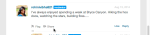

# Localizza stringhe{#localize-strings}

Personalizzazione delle stringhe delle app Livefyre.

È possibile personalizzare le stringhe di testo per la maggior parte degli elementi HTML in qualsiasi app Livefyre. Questo offre la flessibilità di modificare il testo degli elementi HTML di cui è stato eseguito il rendering, ad esempio il pulsante &quot;Post As&quot;, il testo &quot;Comment Count&quot; o il pulsante &quot;Sign In&quot;, in qualsiasi stringa UTF-8 valida. Utilizza questa funzione per aggiungere personalità all’implementazione del flusso o per localizzare la lingua nell’app per la tua base di utenti.

* Commenti, chat e blog dal vivo

   * [Implementazione](#c-localize-strings/section_im4_224_xz)
   * [Accesso account](#c-localize-strings/section_cm3_d24_xz)
   * [Informazioni flusso](#c-localize-strings/section_wx1_c24_xz)
   * [Ordinamento flusso](#c-localize-strings/section_ih2_124_xz)
   * [Informazioni contenuto](#c-localize-strings/section_llv_yd4_xz)
   * [Contenuto in primo piano](#c-localize-strings/section_gmw_vd4_xz)
   * [Editor di testo](#c-localize-strings/section_ky5_td4_xz)
   * [Opzioni di risposta](#c-localize-strings/section_zvt_qd4_xz)
   * [Notificatore di commenti](#c-localize-strings/section_qqt_pd4_xz)
   * [Messaggi di errore](#c-localize-strings/section_omz_jxn_xz)

* [Formato ora e data](#c-localize-strings/section_yz4_g5n_xz)
* [Parete multimediale](#c-localize-strings/section_vwt_d5n_xz)
* [Mappa](#c-localize-strings/section_fxv_c5n_xz)
* [Mosaico](#c-localize-strings/section_e2s_b5n_xz)
* [Carosello](#c-localize-strings/section_l2z_hkn_xz)
* [Scheda tecnica](#c-localize-strings/section_mw2_hkn_xz)
* [Sondaggio](#c-localize-strings/section_pdg_fwh_xz)
* [Identità Livefyre](#c-localize-strings/section_zc3_xvh_xz)
* Altro:
   * [Rivedi stringhe di testo](/help/using/c-settings-other/c-translation-sets/c-review-text-strings.md#c_review_text_strings)
   * [Note](/help/using/c-settings-other/c-translation-sets/c-sidenotes-text-strings.md#c_sidenotes_text_strings)

## Implementazione {#section_im4_224_xz}

Per implementare questa funzione, passare una mappatura oggetto 1-1 delle stringhe che si desidera ignorare all&#39;oggetto di configurazione JavaScript. Se non si fornisce un campo, verrà utilizzato il testo predefinito.

Esempio:

```
var customStrings = {     
   postAsButton: "New Post As Text",     
   postEditButton: "New Post Edit Text"  
};   
   convConfig["strings"] = customStrings; fyre.conv.load(     
   networkConfig,     
   [convConfig],     
   function(){}  
);
```

Questa pagina elenca tutte le stringhe di testo che possono essere personalizzate per le app core Livefyre.

## Accesso all&#39;account {#section_cm3_d24_xz}

Stringhe disponibili per il processo di autenticazione e dai menu utente autenticati.


| Elemento | Chiave | Testo predefinito |
|---|---|---|
|  | displayName | %s |
|  | editProfile | Modifica profilo |
|  | notificationSettings | Impostazioni delle notifiche |
|  | siteAdmin | Admin Console (collegamenti a Studio) |
|  | signOut | Esci |

## Informazioni flusso {#section_wx1_c24_xz}

Stringhe disponibili per le informazioni e la visualizzazione del flusso di contenuto. Elenca il numero di persone in ascolto, il numero di post nell&#39;app e consente agli utenti di accedere o accedere alle informazioni del loro account.

| Chiave | Testo predefinito | Dati flusso |
|---|---|---|
|  | commentCountLabelZero | Commento %s |
|  | commentCountLabel | Commento %s |
|  | commentCountLabelPlural | %s commenti |
|  | listenerCount | ascolto personale |
|  | listenerCountPlural | gente che ascolta |
|  | liveblogPostCountLabelZero | postare |
|  | liveblogPostCountLabel | postare |
|  | liveblogPostCountLabelPlural | post |
| Opzioni thread | threadBreakoutButton | Mostra intero thread |
|  | toggleCollapse | Attiva/disattiva Comprimi |
| Commenti in coda/ad alta velocità | aggiorna | Aggiorna |
|  | newComment | Nuovo commento |
|  | newComments | Nuovi commenti |
|  | newReply | nuova risposta |
|  | newReplies | nuove risposte |

## Ordinamento flusso {#section_ih2_124_xz}

Consente agli utenti di ordinare il contenuto restituito in base all’età o alla popolarità.


| Chiave | Testo predefinito | Opzioni intestazione |
|---|---|---|
|  | sortNewest | Più recente |
|  | sortOldest | Oldest |
|  | sortTopComments | Commenti principali |
|  | sortHotThreads | Thread caldi |
|  | sortSeparator |  |  |
|  | streamOrting | Caricamento |
|  | topCommentsContentNotFoundMsg | Non ci sono ancora abbastanza &quot;mi piace&quot;. |
|  | hotThreadsContentNotFoundMsg | Non ci sono ancora abbastanza thread. |
|  | streamRefreshMsg | Scopri le novità. |
| Opzioni piè di pagina | archiveHeaderTitle | Dall&#39;archivio |
|  | archiveShowMore | Mostra altro |
|  | showMore | Mostra altri commenti |
|  | showMoreLiveblog | Mostra altri post |


## Informazioni contenuto {#section_llv_yd4_xz}

Elenca le informazioni sui post: nome utente, eventuali tag utente applicati e ora del post.

  

| Chiave | Testo predefinito | Autore |
|---|---|---|
|  | moderatore | moderatore |
|  | hovercardViewProfile | Visualizza profilo completo |
| Informazioni post | timeJustNow | ora |
|  | timeMinutesAgo | minuto fa |
|  | timeMinutesAgoPlural | minuti fa |
|  | timeHoursAgo | ora fa |
|  | timeHoursAgoPlural | ore fa |
|  | timeDaysAgo | giorno fa |
|  | timeDaysAgoPlural | giorni fa |
|  | likePlural | Mi piace |
|  | likeSingular | Mi piace |
|  | moderatorEditTimestamp | Modificato da un moderatore |
|  | commentTombstone | Questo commento è stato eliminato |
|  | permalinkNotFoundMsg | Questo commento non è più visibile. |
|  | quickProfileTooltip | Profilo rapido |

## Contenuto in primo piano {#section_gmw_vd4_xz}

Se attivato, il contenuto in primo piano viene elencato nella parte superiore del flusso.

|  | Chiave | Testo predefinito |
|---|---|---|
| Etichette |  |  |
|  | featuredCommentsTag | Disponibile |
|  | featuredCommentsTitlePlural | Commenti |

## Editor di testo {#section_ky5_td4_xz}

Per impostazione predefinita, è disponibile nella parte superiore della pagina per tutti gli utenti.


|  | Chiave | Testo predefinito |
|---|---|---| 
| Pulsanti dell’editor | seguire | + Segui |
|  | non seguire | - Non segui |
|  | liveblogFollow | Segui blog dal vivo |
|  | liveblogUnfollow | Annulla blog dal vivo |
|  | postButton(Disponibile per gli utenti connessi). | Commento post |
|  | postAsButton(Disponibile per utenti non autenticati.) | Pubblica commento come... |
|  | postEditButton | Modifica commento |
|  | postEditAsButton | Modifica commento come... |
|  | postEditCancelButton | Annulla |
|  | editorDisabilitato | Questa conversazione è attualmente chiusa ai nuovi commenti. |
| Opzioni chat | livechatPostButtonLabel | Post |
|  | livechatPostEditButton | Modificare       |
|  | livechatWindowsIstruzione | Premere Ctrl+Enter per postare |
|  | livechatOtherIstruzione | Premere il comando+enter per pubblicare |

## Opzioni di risposta {#section_zvt_qd4_xz}

Salvo diversa indicazione, disponibile per tutti gli utenti connessi. Passa il puntatore del mouse su un pannello di contenuto per accedervi.


| Chiave | Testo predefinito |  |
|---|---|---|
| Opzioni di risposta utente | Disponibile per gli utenti finali. |  |
| flagButton | Contrassegna |
|  | flagCommentTooltip | Contrassegna |
|  | editButton(Disponibile solo per autori e moderatori, se attivato). | Modificare       |
|  | deleteButton(Disponibile solo per autori e moderatori, se attivato). | Elimina |
|  | deleteCommentTooltip | Elimina |
|  | shareButton | Condividi |
|  | shareCommentTooltip | Condividi |
|  | likeButton | Mi piace |
|  | a differenza diButton | Non mi piace |
|  | responseButton | Rispondi |
|  | replyButtonSingular(Disponibile per Chat e Live Blog) | Rispondi |
|  | responseButtonPlural(Disponibile per Chat e Live Blog). | Risposte |



| Chiave | Testo predefinito |  |
|---|---|---|
| Flag modale | flagTitle | Contrassegna il commento di %s |
|  | flagSubtitle | Contrassegna come |
|  | flagDefaultSelectOption | Seleziona |
|  | flagSpam | Spam |
|  | flagSpamButton | Spam |
|  | flagSpamCommentTooltip | Spam |
|  | flagOffensive | Offensivo |
|  | flagOffensiveButton | Offensivo |
|  | flagOffensiveCommentTooltip | Offensivo |
|  | flagNonD | Non concordo |
|  | flagDisagreementButton | Non concordo |
|  | flagDisallowCommentTooltip | Non concordo |
|  | flagOffTopic | Argomento disattivato |
|  | flagOfftopicButton | Argomento disattivato |
|  | flagOfftopicCommentTooltip | Argomento disattivato |
|  | flagEmail | E-mail |
|  | flagEmailPlaceholder | you@example.com |
|  | flagNotes | Note |
|  | flagNotesPlaceholder | Inizia a digitare qui... |
|  | flagConfirmButton | OK |
|  | flagCancelButton | Annulla |
|  | flagConfirmationMessage | Contrassegna il commento di %s come %s? |
|  | flagSuccessMsg | Il commento è stato contrassegnato. |


| Chiave | Testo predefinito |  |
|---|---|---|
| Condividi modale | shareTitle | Condividi commento |
|  | sharePlaceholderText | Cosa ne pensate? |
|  | shareLabel | Condividi su: |
|  | shareTextTwitter | vuoto |
|  | shareTextFacebook | vuoto |
|  | shareTextLinkedin | vuoto |
|  | shareButtonText | Condividi |
|  | sharePermalink | Permalink |
|  | loadingPermalink | Caricamento URL breve in corso.. |
|  | shareText | Ho appena postato un commento. Guardate! |


| Chiave | Testo predefinito |  |
|---|---|---|
| modale di risposta | postReplyAsButton | Pubblica commento come... |
|  | postReplyButton(Disponibile per gli utenti connessi). | Commento post |
|  | backToHotThreads | Torna a Hot Thread |


| Chiave | Testo predefinito |  |
|---|---|---|
| modale twitter @mention | mentionTitle | Condividi menzione |
|  | mentionSubtitleTwitter | Condividi tweet con: |
|  | mentionDefaultText | Ti ho menzionato in un commento su Livefyre! |
|  | mentionConfirmButton | OK |
|  | mentionCancelButton | Annulla |
|  | mentionErrorGeneral | Oops! Qualcosa è andato storto! Livefyre è stato avvisato. |
|  | mentionErrorNoneSelected | È necessario che sia abilitato almeno un riferimento. |
|  | mentionMenuTitle | Per vedere e menzionare i tuoi amici |
|  | mentionTwitterConnect | Connessione a Twitter |
|  | mentionTwitterFetching | Recupero amici... |
|  | mentionSuccessMsg | Le menzioni sono state inviate correttamente. |


| Chiave | Testo predefinito |  |
|---|---|---|
| Modifica modale | Disponibile per amministratori di studio, manager utente o moderatori |  |
| @(@menzione) | &lt;/>Apre la finestra HTML personalizzata. |  |
|  | customHtmlDialogTitle(Viene visualizzato come intestazione del modale). | Aggiungi HTML personalizzato |


| Chiave | Testo predefinito |  |
|---|---|---|
| Opzioni di risposta del moderatore | Disponibile per amministratori da studio, manager utente o moderatori. |  |
| pendingComment | in sospeso |
|  | banUserButton | Utente bloccato |
|  | banUserTooltip | Utente non autorizzato |
|  | bozoButton | Bozo |
|  | bozoCommentTooltip | Bozo |
|  | featureButton | Funzione |
|  | featureCommentTooltip | Funzione |
|  | unfeatureButton | Annulla funzione |
|  | featuredCommentTooltip | Annulla funzione |


| Chiave | Testo predefinito |  |
|---|---|---|
| Finestra modale di interdizione utente | Disponibile per amministratori da studio, manager utente o moderatori. |  |
| banTitle | Utente non autorizzato |  |
|  | banConfirmation | Vietare l&#39;utente? |
|  | banConfirmButton | OK |
|  | banCancelButton | Annulla |

## Notificatore di commenti {#section_qqt_pd4_xz}

Se attivato, disponibile nella parte inferiore della pagina per tutte le app di conversazione Livefyre.


|  | Chiave | Testo predefinito |
|---|---|---|
| Etichette per i notificatori | commentNotifier | Nuovo commento |
|  | commentNotifierPlural | Nuovi commenti |
|  | liveblogNotifier | Nuovo post |
|  | liveblogNotifierPlural | Nuovi post |

## Messaggi di errore {#section_omz_jxn_xz}

Stringhe disponibili per messaggi di errore personalizzabili.

| Chiave | Testo predefinito |
|---|---|
| errorAuthError | Non sei autorizzato a pubblicare un commento su questa conversazione |
| errorCommentsNotAllowed | Commenti non consentiti in questa conversazione |
| errorDefault | Errore. Riprova. |
| errorDuplicate | Per quanto ti sia piaciuto il tuo commento, non ti è consentito pubblicarlo due volte. |
| errorEditDuplicate | È necessario modificare il corpo del commento quando lo si modifica. |
| errorEditNotAllowed | Non è consentito modificare i commenti su questa conversazione. |
| errorEditTimeSuperato | Il periodo di modifica dei commenti è scaduto. |
| errorEmpty | Sembra che tu stia tentando di pubblicare un commento vuoto. |
| errorExpired | La sessione è scaduta. Ricarica la pagina. |
| errorFlagNotSelected | Selezionare un tipo di flag. |
| errorGuestLiked | Spiacente, solo quelli con account possono piacere il contenuto. |
| errorInsufficientePermissions | Autorizzazioni insufficienti |
| errorInvalidChar | Sembra che tu stia tentando di pubblicare un carattere non valido. |
| errorLikeOwnComment | Non puoi apprezzare il tuo commento personale |
| errorMalform | Sembra che tu stia tentando di pubblicare contenuto non valido. |
| errorMaxChars | Spiacente, il tuo commento è troppo lungo. Modifica e riprova. |
| errorMediaNotAvailable | Il contenuto multimediale non è più visibile. |
| errorShowMore | Errore durante il caricamento di altri commenti. |
| MultipleMediaNotAllowedError | Le tue autorizzazioni ti concedono un solo allegato multimediale alla volta. |

## Formato ora e data {#section_yz4_g5n_xz}

Traduci e personalizza l’aspetto delle date sulle schede dei contenuti nelle app di visualizzazione.

| Chiave | Testo predefinito |
|---|---|
| hoursAgo | {numero}h |
| hoursAgoSingular | {numero}h |
| justNow | 1s |
| minutesAgo | {numero}m |
| minutesAgoSingular | {numero}m |
| monthDayFormat | {day} {monthAbbrev} |
| monthDayYearFormat | {day} {monthAbbrev} {year} |
| monthNames | Gennaio, febbraio, marzo, aprile, maggio, giugno, luglio, agosto, settembre, ottobre, novembre, dicembre |
| monthNamesAbbrev | Gen, Feb, Mar, Apr, May, Jun, Jul, Aug, Set, Oct, Nov, Dic |
| secondsAgo | {numero}s |
| secondsAgoSingular | {numero}s |

## Muro di supporto {#section_vwt_d5n_xz}

Stringhe disponibili per Media Wall App.

| Chiave | Testo predefinito |
|---|---|
| featuredText | Disponibile |
| shareButtonText | Condividi |

| Chiave | Testo predefinito |
|---|---|
| postButtonText | Cosa avete in mente? |
| postModalTitle | Pubblica il tuo commento |
| postModalButton | Pubblica il tuo commento |
| postModalPlaceholder | Cosa vorresti dire? |
| showMoreButtonText | Carica altro |
| shareButtonText | Condividi |

## Mappa {#section_fxv_c5n_xz}

Stringhe disponibili per le mappe.

| Chiave | Testo predefinito |
|---|---|
| featuredText | Disponibile |
| shareButtonText | Condividi |

## Mosaico {#section_e2s_b5n_xz}

Stringhe disponibili per Mosaics.

| Chiave | Testo predefinito |
|---|---|
| featuredText | Disponibile |
| shareButtonText | Condividi |

## Carosello {#section_l2z_hkn_xz}

Stringhe disponibili per Carosello.

| Chiave | Testo predefinito |
|---|---|
| featuredText | Disponibile |
| shareButtonText | Condividi |

## Scheda funzione {#section_mw2_hkn_xz}

Stringhe disponibili per la scheda di funzioni.

| Chiave | Testo predefinito |
|---|---|
| featuredText | Disponibile |
| shareButtonText | Condividi |

## Carica app {#section_grc_gkn_xz}

Stringhe disponibili per l’app di caricamento.

| Chiave | Testo predefinito |
|---|---|
| postButtonText | Cosa avete in mente? |
| postModalTitle | Pubblica il tuo commento |
| postModalButton | Pubblica il tuo commento |
| postModalTitlePlaceholder | Immettere un titolo |
| postModalPlaceholder | Cosa vorresti dire? |
| postModalConfirmTitle | Grazie per aver pubblicato! |
| postModalConfirmationMessage | Il tuo post è in fase di revisione. |
| postModalConfirmationButton | Fine |
| title |  |
| message |  |
| editorErrorAttachmentsRequired | È necessario un allegato |
| editorErrorBody | Aggiungi un messaggio |
| editorErrorDuplicate | Per quanto ti piace la tua nota, non puoi inviarla due volte |
| editorErrorGeneric | Errore |
| editorErrorTitleRequired | È necessario un titolo |

## Sondaggio {#section_pdg_fwh_xz}

Stringhe disponibili per i sondaggi.

| Chiave | Testo predefinito |
|---|---|
| totalVotesLabel | %s voti totali |
| shareStringText | Ho appena votato su %s, qual è il tuo voto? |
| pollClosedLabel | Il sondaggio è attualmente chiuso |

## Identità Livefyre {#section_zc3_xvh_xz}

Stringhe disponibili per Livefyre Identity.

| Chiave | Testo predefinito |
|--- |--- |
| automaticamenteFollowConversations | Segui automaticamente le conversazioni a cui mi unisco |
| indietro | Indietro |
| bio | Bio |
| creare | Creare    |
| createANewAccount | Crea nuovo account |
| createNewAccountWithEmail | Crea un nuovo account tramite e-mail |
| changeAvatar | Cambia avatar |
| selectFile | Scegli file |
| completeAccount | Account completo |
| emailWhenQualcunoReplies | Invia un&#39;e-mail quando qualcuno mi risponde |
| emailCommentsIFollow | Commenti e-mail nelle conversazioni che seguo |
| emailSenttoResetPassword | E-mail inviata! Seleziona la casella in entrata per un collegamento per reimpostare la password |
| emailVerificationSent | Verifica e-mail inviata |
| firstName | Nome |
| dimenticatoPassword | Password dimenticata? |
| dimenticatoYourPassword | Hai dimenticato la password? |
| dimenticatoYourPasswordIstruzioni | Inserisci il tuo nome utente o indirizzo e-mail qui sotto e ti invieremo un link per cambiare la tua password. |
| formInputCloseButtonText | Close |
| formInputCancelButtonText | Annulla |
| formInputSaveButtonText | Salva |
| hasNotLeftAnyComments | non ha lasciato alcun commento |
| locationIsFrom | da |
| labelAvatar | Avatar |
| labelComments | Commenti |
| labelConfirmNewPassword | Conferma nuova password |
| labelConfirmPassword | Conferma password |
| labelEmail | Email Address |
| labelLike | Mi piace |
| labelLoading | Caricamento |
| labelNewPassword | Nuova password |
| labelNotification | Notifiche |
| labelPassword | Password |
| labelProfile | Profilo |
| labelUsername | Nome utente |
| labelUsernameOrEmail | Nome utente o e-mail |
| lastName | Cognome |
| livefyreAccount | Account Livefyre |
| la posizione | Posizione |
| loadingProfile | Caricamento del profilo |
| newPassword | Nuova password |
| oldPassword | Password precedente |
| su | su |
|  oppure  |  oppure  |
| passwordLinkExpired | Il collegamento che hai fatto clic per reimpostare la password è scaduto. Reimposta nuovamente la password e riceverai un nuovo collegamento. |
| PleasecheckEmailToComplete | Per completare la registrazione, controlla l&#39;e-mail. |
| postato | Pubblicato |
| poweredBy | alimentato da |
| profileNotificationImmediate | nelle immediate vicinanze |
| profileNotificationHourly | orario |
| profileNotificationNever | mai |
| RecentComments | Commenti recenti |
| reset | Reimposta |
| resetPassword | Ripristina password |
| signIn | Accesso |
| signInWith | Accedi con |
| signInWithEmail | Accesso tramite e-mail |
| signUp | Iscriviti |
| socialAccount | Account social |
| successPasswordChanged | Completato! La password è stata modificata e ora hai effettuato l&#39;accesso |
| termAndConditions | Termini e condizioni |
| termAndConditionsIntro | Registrandoti accetti la |
| termOfUse | Condizioni d&#39;uso |
| termOfUseIntro | Effettuando l&#39;accesso, accetti di: |
| thisUser | Questo utente |
| verifyPassword | Verifica password |
| fileSizeLimit | max 2 MB |
| contabile non trovato | Account non trovato |
| avatarImageExceedSize | L&#39;immagine avatar ha superato il limite di 2 mb del file |
| campo | Il campo accetta solo un numero intero |
| fieldonlyaccettsavalidemail | Solo un campo accetta un’e-mail valida |
| fieldonlyaccettsletters | Il campo accetta solo lettere |
| filesizemustbelessthanMB | La dimensione del file deve essere inferiore a {#}MB |
| invalidusernameorpassword | Nome utente o password non validi |
| minimumlength dei caratteri | Lunghezza minima dei caratteri {#} |
| maximumlength dei caratteri | Lunghezza massima dei caratteri {#} |
| therwasanerror | Errore |
| questo campo non richiesto | Questo campo è obbligatorio. |
| validfileextensions | Estensioni file valide |
| valueEMustmatch | Il valore deve corrispondere |
| passwordLength | deve essere lungo da 6 a 32 caratteri. |
| passwordCharacters | includere sia caratteri minuscoli che maiuscoli. |
| passwordSimboli | includere almeno un numero e un simbolo. |
| passwordNome utente | non contiene il tuo nome utente. |
| passwordPoverTitle | La password deve: |
| passwordErrorContainsFirstName | La password immessa contiene il nome utente, il nome utente o il cognome. Per motivi di sicurezza, inserisci una password che non contenga nome utente, nome o cognome. Ricorda inoltre che la password deve contenere: Da 6 a 32 caratteri Un carattere maiuscolo Un carattere minuscolo Un simbolo |
| passwordErrorContainsLastName | La password immessa contiene il nome utente, il nome utente o il cognome. Per motivi di sicurezza, inserisci una password che non contenga nome utente, nome o cognome. Ricorda inoltre che la password deve contenere: Da 6 a 32 caratteri Un carattere maiuscolo Un carattere minuscolo Un simbolo |
| passwordErrorContainsUsername | La password immessa contiene il nome utente, il nome utente o il cognome. Per motivi di sicurezza, inserisci una password che non contenga nome utente, nome o cognome. Ricorda inoltre che la password deve contenere: Da 6 a 32 caratteri Un carattere maiuscolo Un carattere minuscolo Un simbolo |
| passwordErrorTooShort | Almeno 6 caratteri per la password |
| passwordErrorTooLong | Massimo 32 caratteri per la password |
| passwordErrorMissingUppercase | La password deve contenere almeno un carattere maiuscolo |
| passwordErrorMissingLowercase | La password deve contenere almeno un carattere minuscolo |
| passwordErrorMissingSymbol | La password deve contenere almeno un simbolo nel set `!@#$%^&*()?.,<>\’;:”[]{}|` |
