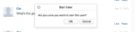
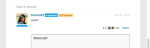

# Localizza stringhe{#localize-strings}

Personalizzazione delle stringhe di Livefyre Apps.

Le stringhe di testo per la maggior parte degli elementi HTML in qualsiasi app Livefyre possono essere personalizzate. Ciò offre la flessibilità di modificare il testo degli elementi HTML renderizzati, ad esempio il pulsante «Post con nome», il testo «Conteggio commenti» o il pulsante «Accesso» a qualsiasi stringa UTF -8 valida. Utilizzate questa funzione per aggiungere personalità all'implementazione del flusso o per localizzare la lingua nell'app per la vostra base utente.

* Commenti, chat e blog dal vivo

   * [Implementazione](#c-localize-strings/section_im4_224_xz)
   * [Accesso account](#c-localize-strings/section_cm3_d24_xz)
   * [Informazioni flusso](#c-localize-strings/section_wx1_c24_xz)
   * [Ordinamento flusso](#c-localize-strings/section_ih2_124_xz)
   * [Informazioni contenuto](#c-localize-strings/section_llv_yd4_xz)
   * [Contenuti contenuti](#c-localize-strings/section_gmw_vd4_xz)
   * [Editor di testo](#c-localize-strings/section_ky5_td4_xz)
   * [Opzioni risposta](#c-localize-strings/section_zvt_qd4_xz)
   * [Notifier Notifier](#c-localize-strings/section_qqt_pd4_xz)
   * [Messaggi di errore](#c-localize-strings/section_omz_jxn_xz)

* [Formato data e ora](#c-localize-strings/section_yz4_g5n_xz)
* [Media Wall](#c-localize-strings/section_vwt_d5n_xz)
* [Mappa](#c-localize-strings/section_fxv_c5n_xz)
* [Mosaic](#c-localize-strings/section_e2s_b5n_xz)
* [Carosello](#c-localize-strings/section_l2z_hkn_xz)
* [Scheda Funzioni](#c-localize-strings/section_mw2_hkn_xz)
* [Sondaggio](#c-localize-strings/section_pdg_fwh_xz)
* [Livefyre Identity](#c-localize-strings/section_zc3_xvh_xz)
* Altro:
   * [Rivedi stringhe di testo](/help/using/c-settings-other/c-translation-sets/c-review-text-strings.md#c_review_text_strings)
   * [Sidenotes](/help/using/c-settings-other/c-translation-sets/c-sidenotes-text-strings.md#c_sidenotes_text_strings)

## Implementazione {#section_im4_224_xz}

Per implementare questa funzione, passare una mappatura di oggetti 1-1 delle stringhe che desiderate ignorare all'oggetto di configurazione javascript. Se non fornite un campo, verrà utilizzato il testo predefinito.

Esempio:

```
var customStrings = {     
   postAsButton: "New Post As Text",     
   postEditButton: "New Post Edit Text"  
};   
   convConfig["strings"] = customStrings; fyre.conv.load(     
   networkConfig,     
   [convConfig],     
   function(){}  
);
```

Questa pagina elenca tutte le stringhe di testo che possono essere personalizzate per le app core Livefyre.

## Accesso account {#section_cm3_d24_xz}

Stringhe disponibili per il processo Autenticazione e dai menu utente autenticati.


| Elemento | Chiave | Testo predefinito |
|---|---|---|
|  | Displayname | % s |
|  | Editprofile | Modifica profilo |
|  | Notificationsettings | Impostazioni notifiche |
|  | Siteadmin | Admin Console (collegamenti a Studio) |
|  | Signout | Disconnetti |

## Informazioni flusso {#section_wx1_c24_xz}

Stringhe disponibili per le informazioni sul flusso di contenuto e la visualizzazione. Mostra il numero di persone che ascolto, il numero di post all'app e consente agli utenti di accedere o accedere alle informazioni sull'account.

| Chiave | Testo predefinito | Flusso dati |
|---|---|---|
|  | Commentcountlabelzero | % s commento |
|  | Commentcountlabel | % s commento |
|  | Commentcountlabelpleral | % s commenti |
|  | Listenercount | persona ascolto |
|  | Listenercountplural | persone ascolto |
|  | Liveblogpostcountlabelzero | post |
|  | Liveblogpostcountlabel | post |
|  | Liveblogpostcountlabelplural | post |
| Opzioni Thread | Threadbreakoutbutton | Mostra intero thread |
|  | Togglecollapse | Attiva/disattiva comprimi |
| Commenti ad alta velocità/in coda | refresh | Aggiorna |
|  | Newcomment | Nuovo commento |
|  | Newcomments | Nuovi commenti |
|  | Newreply | nuova risposta |
|  | Newreplies | nuove risposte |

## Ordinamento flusso {#section_ih2_124_xz}

Consente di ordinare i contenuti restituiti per età o popolarità.


| Chiave | Testo predefinito | Opzioni dell'intestazione |
|---|---|---|
|  | Sortnewest | Più recente |
|  | Sortoldest | Meno recente |
|  | Sorttopcomments | Commenti principali |
|  | Sorthotthreads | Hot Thread |
|  | Sortseparator |  |  |
|  | Streamsorting | Caricamento |
|  | Topcommentpurchentnotfoundmsg | Non ci sono ancora abbastanza mi piace. |
|  | Hotthreadpurchentnotfoundmsg | Non ci sono ancora abbastanza thread. |
|  | Streamrefreshmsg | Scopri le novità. |
| Opzioni piè di pagina | Archiveheadertitle | Dall'archivio |
|  | Archiveshowmore | Mostra altro |
|  | Showmore | Mostra altri commenti |
|  | Showmoreliveblog | Mostra altri post |


## Informazioni contenuto {#section_llv_yd4_xz}

Elenca le informazioni post: nome utente, tag utente applicati e tempo post.

  

| Chiave | Testo predefinito | Autore |
|---|---|---|
|  | moderatore | moderatore |
|  | Hovercardviewprofile | Visualizza profilo completo |
| Post info | Timejustnow | just now |
|  | Timeminutesago | minuto fa |
|  | Timeminutesagoplural | minuti fa |
|  | Timehoursago | ora fa |
|  | Timehoursagoplural | ore fa |
|  | Timedaysago | giorno fa |
|  | Timedaysagoplural | giorni fa |
|  | Likoloeral | Mi piace |
|  | Likessingular | Come |
|  | Moderatoredittimestamp | Modificato da un moderatore |
|  | Commenttombstone | Questo commento è stato eliminato |
|  | Permalinknotfoundmsg | Questo commento non è più visibile. |
|  | Quickprofiletooltip | Profilo rapido |

## Contenuti contenuti {#section_gmw_vd4_xz}

Se abilitata, il contenuto visualizzato è elencato nella parte superiore dello stream.

|  | Chiave | Testo predefinito |
|---|---|---|
| Etichette in evidenza |  |  |
|  | Featuredcommentstag | Contenuti |
|  | Featuredcommentstitleplural | Commenti contenuti |

## Editor di testo {#section_ky5_td4_xz}

Per impostazione predefinita, è disponibile nella parte superiore della pagina per tutti gli utenti.


|  | Chiave | Testo predefinito |
|---|---|---| 
| Pulsanti Editor | segui | + Segui |
|  | unfollow | - Non seguire |
|  | Liveblogfollow | Seguite il blog Live |
|  | Liveblogunfollow | Non seguire il blog Live |
|  | Postbutton (disponibile per l'accesso agli utenti.) | Commento post |
|  | Postasbutton (disponibile per utenti non autenticati). | Invia commento come… |
|  | Posteditbutton | Modifica commento |
|  | Posteditasbutton | Modifica commento come… |
|  | Posteditcancelbutton | Annulla |
|  | Editordisabled | Questa conversazione è attualmente chiusa a nuovi commenti. |
| Opzioni chat | Livechatpostbuttonlabel | Post |
|  | Livechatposteditbutton | Modifica |
|  | Livechatwindowsinpression | Premere Ctrl + enter per pubblicare |
|  | Livechatotherinstruction | Premi comando + enter per pubblicare |

## Opzioni risposta {#section_zvt_qd4_xz}

Se non diversamente specificato, è disponibile per tutti gli utenti che hanno eseguito l'accesso. Passate il mouse su un pannello di contenuto per accedere.



| Chiave | Testo predefinito |  |
|---|---|---|
| Opzioni risposta utente | Disponibile per gli utenti finali. |  |
| Flagbutton | Flag |
|  | Flagcommenttooltip | Flag |
|  | Editbutton (disponibile solo per autori e moderatori, se attivato.) | Modifica |
|  | Deletebutton (disponibile solo per autori e moderatori, se attivato.) | Elimina |
|  | Deletecommenttooltip | Elimina |
|  | Sharebutton | Condividi |
|  | Sharecommenttooltip | Condividi |
|  | Likebutton | Come |
|  | Unlikebutton | A differenza |
|  | Replybutton | Risposta |
|  | Replybuttonsingular (Disponibile per Chat e Blog live.) | Risposta |
|  | Replybuttonplural (Disponibile per Chat e Blog live.) | Risposte |


| Chiave | Testo predefinito |  |
|---|---|---|
| Flag modale | Flagtitle | Segnala commento % s |
|  | Flagsubtitle | Flag |
|  | Flagdefaultselectoption | Seleziona |
|  | Flagspam | Spam |
|  | Flagspambutton | Spam |
|  | Flagspamcommenttooltip | Spam |
|  | Flagoffensive | Offensivo |
|  | Flagorevsivebutton | Offensivo |
|  | Flagorevsivecommenttooltip | Offensivo |
|  | Flagd | Non d'accordo |
|  | Flagdisagreebutton | Non d'accordo |
|  | Flagdisagreecommenttooltip | Non d'accordo |
|  | Flagofftopic | Argomento Off |
|  | Flagofftopicbutton | Argomento Off |
|  | Flagofftopiccommenttooltip | Argomento Off |
|  | Flagemail | E-mail |
|  | Flagemailplaceholder | you@example.com |
|  | Flagnotes | Note |
|  | Flagnotesplaceholder | Inizia a digitare qui… |
|  | Flagconfirmbutton | OK |
|  | Flagcancelbutton | Annulla |
|  | Flagconfirmationmessage | Segnalare il commento di % s come % s? |
|  | Flagsuccessmsg | Commento contrassegnato. |


| Chiave | Testo predefinito |  |
|---|---|---|
| Modale condivisione | Sharetitle | Condividi commento |
|  | Shareplaceholdertext | Che cosa pensate? |
|  | Sharelabel | Condividi su: |
|  | Sharetexttwitter | blank |
|  | Sharetextfacebook | blank |
|  | Sharetextlinkedin | blank |
|  | Sharebuttontext | Condividi |
|  | Sharepermalink | Permalink |
|  | Loadingpermalink | Caricamento URL breve… |
|  | Sharetext | Ho appena pubblicato un commento. Check it out! |


| Chiave | Testo predefinito |  |
|---|---|---|
| Modale risposta | Postreplyasbutton | Invia commento come… |
|  | Postreplybutton (disponibile per l'accesso agli utenti.) | Commento post |
|  | Backtohotthreads | Torna a Thread sensibili |



| Chiave | Testo predefinito |  |
|---|---|---|
| Twitter @ menzioni modale | Mentiontitle | Condividi |
|  | Mentionsubtitletter | Condividi tweet per: |
|  | Mentiondefaulttext | I mentioned you in a Livefyre comment! |
|  | Mentionconfirmbutton | OK |
|  | Mentioncancelbutton | Annulla |
|  | Mentionerrorgeneral | Ops! Si è verificato un problema! Livefyre è stato avvisato. |
|  | Mentionerrornoneselected | Devi avere almeno un nome abilitato. |
|  | Mentionmenutitle | Per visualizzare e nominare i vostri amici |
|  | Mentiontwitterconnect | Connetti a Twitter |
|  | Mentiontwitterfetching | Recupero degli amici… |
|  | Mentionsuccessmsg | Le menzioni sono state inviate correttamente. |


| Chiave | Testo predefinito |  |
|---|---|---|
| Modifica modale | Disponibile per Amministratori di studio, Manager utente o Moderatori |  |
| @ (@ menzioni.) | </> (Apre la finestra HTML personalizzata.) |  |
|  | Customhtmldialogtitle (viene visualizzato come intestazione del modale.) | Aggiungi HTML personalizzato |


| Chiave | Testo predefinito |  |
|---|---|---|
| Opzioni di risposta moderatore | Disponibile per Amministratori di studio, Manager utente o Moderatori. |  |
| Pendingcomment | pending |
|  | Banuserbutton | Divieto utente |
|  | Banusertooltip | Divieto utente |
|  | Bozobutton | Bozo |
|  | Bozocommenttooltip | Bozo |
|  | Featurebutton | Funzione |
|  | Featurecommenttooltip | Funzione |
|  | Unfeaturebutton | Funzionalità |
|  | Featuredcommenttooltip | Funzionalità |


| Chiave | Testo predefinito |  |
|---|---|---|
| Divieto modale utente | Disponibile per Amministratori di studio, Manager utente o Moderatori. |  |
| Bantitle | Divieto utente |  |
|  | Banconfirmation | Volete veramente vietare questo utente? |
|  | Banconfirmbutton | OK |
|  | Bancancelbutton | Annulla |

## Notifier Notifier {#section_qqt_pd4_xz}

Se abilitata, disponibile nella parte inferiore della pagina per tutte le app di conversazione di Livefyre.


|  | Chiave | Testo predefinito |
|---|---|---|
| Etichette del modulo di notifica | Commentnotifier | Nuovo commento |
|  | Commentnotifierplural | Nuovi commenti |
|  | Liveblognotifier | Nuovo post |
|  | Liveblognotifierplural | Nuovi post |

## Messaggi di errore {#section_omz_jxn_xz}

Stringhe disponibili per messaggi di errore personalizzabili.

| Chiave | Testo predefinito |
|---|---|
| Errorautherror | Non sei autorizzato a pubblicare un commento in questa conversazione |
| Errorcommentsnotallowed | I commenti non sono consentiti in questa conversazione |
| Errordefault | Si è verificato un errore. Riprovate. |
| Errorduplicate | Non è possibile pubblicare due volte il commento. |
| Erroreditduplicate | È necessario modificare il corpo del commento quando lo si modifica. |
| Erroreditnotallowed | Non è possibile modificare i commenti in questa conversazione. |
| Erroredittimeexceeded | Il periodo di modifica dei commenti è scaduto. |
| Errorempty | Sembra che stiate tentando di pubblicare un commento vuoto. |
| Errorexpired | La sessione è scaduta. Ricaricate la pagina. |
| Errorflagnotselected | Selezionate un tipo di flag. |
| Errorguestliked | Solo quelli con account possono disporre di contenuto. |
| Errorinsufficientpermissions | Autorizzazioni insufficienti |
| Errorinvalidchar | Sembra che stiate tentando di pubblicare un carattere non valido. |
| Errorlikeowncomment | Non è possibile aggiungere un commento |
| Errormalformat | Sembra che stiate tentando di pubblicare contenuti non formattati. |
| Errormaxchars | Il commento è troppo lungo. Please edit and try again. |
| Errormedianotavailable | Il file multimediale non è più visibile. |
| Errorshowmore | Si è verificato un errore durante il caricamento di altri commenti. |
| Moltiemedianotallowederror | Le autorizzazioni concedono solo un allegato multimediale alla volta. |

## Formato data e ora {#section_yz4_g5n_xz}

Traducete e personalizzate il modo in cui le date vengono visualizzate sulle schede di contenuto all'interno delle app di visualizzazione.

| Chiave | Testo predefinito |
|---|---|
| Hoursago | {number} h |
| Hoursagosingular | {number} h |
| Justnow | 1s |
| Minutesago | {numero} m |
| Minutesagosingular | {numero} m |
| Monthdayformat | {day} {monthabbrev} |
| Monthdayyearformat | {day} {monthabbrev} {year} |
| Monthnames | Gennaio, febbraio, marzo, aprile, maggio, giugno, luglio, agosto, settembre, ottobre, novembre, dicembre |
| Monthnamesabbrev | Gen, Feb, Mar, Apr, May, Jun, Jul, Aug, Sep, Ott, Nov |
| Secondsago | {numero} |
| Secondsagosingular | {numero} |

## Media Wall {#section_vwt_d5n_xz}

Stringhe disponibili per l'app Media Wall.

| Chiave | Testo predefinito |
|---|---|
| Featuredtext | Contenuti |
| Sharebuttontext | Condividi |

| Chiave | Testo predefinito |
|---|---|
| Postbuttontext | Cosa c'è sulla tua idea? |
| Postmodaltitle | Invia commento |
| Postmodalbutton | Invia commento |
| Postmodalplaceholder | Cosa desideri dire? |
| Showmorebuttontext | Carica altro |
| Sharebuttontext | Condividi |

## Mappa {#section_fxv_c5n_xz}

Stringhe disponibili per le mappe.

| Chiave | Testo predefinito |
|---|---|
| Featuredtext | Contenuti |
| Sharebuttontext | Condividi |

## Mosaic {#section_e2s_b5n_xz}

Stringhe disponibili per Mosaics.

| Chiave | Testo predefinito |
|---|---|
| Featuredtext | Contenuti |
| Sharebuttontext | Condividi |

## Carosello {#section_l2z_hkn_xz}

Stringhe disponibili per Carosello.

| Chiave | Testo predefinito |
|---|---|
| Featuredtext | Contenuti |
| Sharebuttontext | Condividi |

## Scheda Funzioni {#section_mw2_hkn_xz}

Stringhe disponibili per la scheda delle funzioni.

| Chiave | Testo predefinito |
|---|---|
| Featuredtext | Contenuti |
| Sharebuttontext | Condividi |

## Carica app {#section_grc_gkn_xz}

Stringhe disponibili per l'app di caricamento.

| Chiave | Testo predefinito |
|---|---|
| Postbuttontext | Cosa c'è sulla tua idea? |
| Postmodaltitle | Invia commento |
| Postmodalbutton | Invia commento |
| Postmodaltitleplaceholder | Inserire un titolo |
| Postmodalplaceholder | Cosa desideri dire? |
| Postmodalconfirationtitle | Thank you for posting! |
| Postmodalconfirmationmessage | Il post è in fase di revisione. |
| Postmodalconfirmationbutton | Fine |
| title |  |
| message |  |
| Editorerrorattachmentsrequired | È necessario un allegato |
| Editorerrorbody | Aggiungete un messaggio |
| Editorerrorduplicate | Non è possibile pubblicare due volte la nota |
| Editorerrorgeneric | Si è verificato un errore |
| Editorerrortitlerequired | È necessario un titolo |

## Sondaggio {#section_pdg_fwh_xz}

Stringhe disponibili per i sondaggi.

| Chiave | Testo predefinito |
|---|---|
| Totalvoteslabel | % s voti totali |
| Sharestringtext | I just voted on % s what's your your vote? |
| Pollclosedlabel | Il sondaggio è attualmente chiuso |

## Livefyre Identity {#section_zc3_xvh_xz}

Stringhe disponibili per Livefyre Identity.

| Chiave | Testo predefinito |
|--- |--- |
| Automaticallyfollowconversations | Segui automaticamente le conversazioni che partecipa |
| back | Indietro |
| biografia | Biografia |
| create | Crea |
| Createanewaccount | Crea nuovo account |
| Createnewaccountwithemail | Creazione di un nuovo account con e-mail |
| Changeavatar | Modifica avatar |
| Scegli choosefile | Scegli file |
| Completeaccount | Account completo |
| Emailwhensomeonereplies | E-mail quando qualcuno risponde a me |
| Emailcommentsifollow | Commenti e-mail nelle conversazioni Segui |
| Emailsenttoresetpassword | Email sent! Controlla la casella in entrata per reimpostare la password |
| Emailquerationsent | Verifica e-mail inviata |
| Firstname | Nome |
| Forgotpassword | Password dimenticata? |
| Forgotyourpassword | Password dimenticata? |
| Forgotyourpasswordinstructions | Immetti il nome utente o l'indirizzo e-mail di seguito e ti invieremo un collegamento per cambiare la password. |
| Forminputclosebuttontext | Chiudi |
| Forminputcancelbuttontext | Annulla |
| Forminputsavebuttontext | Salva |
| Hasnotleftanycomments | non ha lasciato alcun commento |
| Locationisfrom | proviene da |
| Labelavatar | Avatar |
| Labelcomments | Commenti |
| Labelconfirmnewpassword | Conferma nuova password |
| Labelconfirmpassword | Conferma password |
| Labelemail | Indirizzo e-mail |
| Labellikes | Mi piace |
| Labelloading | Caricamento |
| Labelnewpassword | Nuova password |
| Labelnotification | Notifiche |
| Labelpassword | Password |
| Labelprofile | Profilo |
| Labelusername | Nome utente |
| Labelusernameoremail | Nome utente o e-mail |
| Lastname | Cognome |
| Livefyreaccount | Account Livefyre |
| location | Posizione |
| Loadingprofile | Caricamento profilo |
| Newpassword | Nuova password |
| Oldpassword | Password vecchia |
| su | su |
| oppure | oppure |
| Passwordlinkexpired | Il collegamento che hai fatto clic per reimpostare la password è scaduto. Reimposta nuovamente la password e ti invieremo un nuovo collegamento. |
| Pleasecheckemailtocomplete | Controllate l'e-mail per completare la registrazione. |
| posted | Pubblicato |
| Poweredby | powered by |
| Profilenotificationimmediate | immediato |
| Profilenotificationhourly | orario |
| Profilenotificationnever | never |
| Recentcomments | Commenti recenti |
| reset | Reset (Ripristina) |
| Resetpassword | Reimposta password |
| Signin | Accesso |
| Signinwith | Accesso con |
| Signinwithemail | Accesso con e-mail |
| Signup | Registrati |
| Socialaccount | Social account |
| Successpasswordchanged | Success! La password è stata modificata e hai effettuato l'accesso |
| Termsandcondition | Termini e condizioni |
| Termsandconditionsintro | Accedendo all'accettazione |
| Termsofuse | Termini d'uso |
| Termsofuseintro | L'accesso accetta accettato |
| Thisuser | Questo utente |
| Verifypassword | Verifica password |
| Filesizelimit | 2 MB max |
| accountnotfound | Account non trovato |
| Avatarimageexceedsize | L'immagine avatar supera il limite di file di 2 MB |
| fieldisrequired | Il campo accetta solo un numero intero |
| fieldonlyacceptsavalidemail | Il campo accetta solo un messaggio e-mail valido |
| fieldonlyacceptsletter | Il campo accetta solo lettere |
| Filesizemustbelessthanmb | La dimensione del file deve essere minore di {#}MB |
| invalidusernameorpassword | Nome utente o password non validi |
| riduzione al minimo dei caratteri | Lunghezza minima {#} caratteri |
| maximumlengthofcharacters | Lunghezza massima {#} dei caratteri |
| therewasanerror | Si è verificato un errore |
| thisfieldisrichiesto | Questo campo è obbligatorio. |
| validfileextensions | Estensioni di file valide |
| valuemustmatch | Il valore deve corrispondere |
| Passwordlength | va da 6 a 32 caratteri. |
| Passwordcharacters | includere caratteri maiuscoli e minuscoli. |
| Passwordsymbols | includere almeno un numero e un simbolo. |
| Passwordusername | non contiene il nome utente. |
| Passwordpoweaktitle | La password deve essere: |
| Passworderrorcontainsfirstname | La password inserita contiene il nome utente, nome o cognome. Per motivi di sicurezza, immettete una password che non contenga nome utente, nome o cognome. Ricorda anche che la password deve contenere: Da 6 a 32 caratteri Caratteri maiuscoli A Caratteri minuscoli Simboli Simboli |
| Passworderrorcontainslastname | La password inserita contiene il nome utente, nome o cognome. Per motivi di sicurezza, immettete una password che non contenga nome utente, nome o cognome. Ricorda anche che la password deve contenere: Da 6 a 32 caratteri Caratteri maiuscoli A Caratteri minuscoli Simboli Simboli |
| Passworderrorcontainsusername | La password inserita contiene il nome utente, nome o cognome. Per motivi di sicurezza, immettete una password che non contenga nome utente, nome o cognome. Ricorda anche che la password deve contenere: Da 6 a 32 caratteri Caratteri maiuscoli A Caratteri minuscoli Simboli Simboli |
| Passworderrortooshort | Minimo di 6 caratteri per pasword |
| Passworderrortoolong | Massimo di 32 caratteri per la password |
| Passworderrormissinguppercase | La password deve contenere almeno un carattere maiuscolo |
| Passworderrormissinglowercase | La passsword deve contenere almeno un carattere minuscolo |
| Passworderrormissingsymbol | La password deve contenere almeno un simbolo nel set `!@#$%^&*()?.,<>\’;:”[]{}|` |


