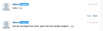
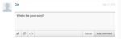

# Localizza stringhe{#localize-strings}

Personalizzazione delle stringhe delle app Livefyre.

È possibile personalizzare le stringhe di testo per la maggior parte degli elementi HTML in qualsiasi app Livefyre. Questo offre la flessibilità di modificare il testo degli elementi HTML di cui è stato effettuato il rendering, ad esempio il pulsante &quot;Post As&quot;, il testo &quot;Comment Count&quot; o il pulsante &quot;Sign In&quot;, in qualsiasi stringa UTF-8 valida. Utilizzate questa funzione per aggiungere personalità all&#39;implementazione del flusso o per localizzare la lingua nell&#39;app per la base di utenti.

* Commenti, chat e blog dal vivo

   * [Implementazione](#c-localize-strings/section_im4_224_xz)
   * [Accesso account](#c-localize-strings/section_cm3_d24_xz)
   * [Informazioni flusso](#c-localize-strings/section_wx1_c24_xz)
   * [Ordinamento flusso](#c-localize-strings/section_ih2_124_xz)
   * [Informazioni contenuto](#c-localize-strings/section_llv_yd4_xz)
   * [Contenuto in evidenza](#c-localize-strings/section_gmw_vd4_xz)
   * [Editor di testo](#c-localize-strings/section_ky5_td4_xz)
   * [Opzioni di risposta](#c-localize-strings/section_zvt_qd4_xz)
   * [Modulo di notifica commenti](#c-localize-strings/section_qqt_pd4_xz)
   * [Messaggi di errore](#c-localize-strings/section_omz_jxn_xz)

* [Formato ora e data](#c-localize-strings/section_yz4_g5n_xz)
* [Muro di supporto](#c-localize-strings/section_vwt_d5n_xz)
* [Mappa](#c-localize-strings/section_fxv_c5n_xz)
* [Mosaico](#c-localize-strings/section_e2s_b5n_xz)
* [Carosello](#c-localize-strings/section_l2z_hkn_xz)
* [Scheda](#c-localize-strings/section_mw2_hkn_xz)
* [Sondaggio](#c-localize-strings/section_pdg_fwh_xz)
* [Identità Livefyre](#c-localize-strings/section_zc3_xvh_xz)
* Altro:
   * [Rivedi stringhe di testo](/help/using/c-settings-other/c-translation-sets/c-review-text-strings.md#c_review_text_strings)
   * [Sidenotes](/help/using/c-settings-other/c-translation-sets/c-sidenotes-text-strings.md#c_sidenotes_text_strings)

## Implementazione {#section_im4_224_xz}

Per implementare questa funzione, trasmettere una mappatura oggetto 1-1 delle stringhe che si desidera ignorare all&#39;oggetto di configurazione JavaScript. Se non si fornisce un campo, verrà utilizzato il testo predefinito.

Esempio:

```
var customStrings = {     
   postAsButton: "New Post As Text",     
   postEditButton: "New Post Edit Text"  
};   
   convConfig["strings"] = customStrings; fyre.conv.load(     
   networkConfig,     
   [convConfig],     
   function(){}  
);
```

In questa pagina sono elencate tutte le stringhe di testo che possono essere personalizzate per le app core Livefyre.

## Accesso account {#section_cm3_d24_xz}

Stringhe disponibili per il processo di autenticazione e dai menu utente autenticati.


| Elemento | Chiave | Testo predefinito |
|---|---|---|
|  | displayName | %s |
|  | editProfile | Modifica profilo |
|  | notificationSettings | Impostazioni di notifica |
|  | siteAdmin | Admin Console  (collegamenti a Studio) |
|  | signOut | Esci |

## Informazioni flusso {#section_wx1_c24_xz}

Stringhe disponibili per le informazioni e la visualizzazione del flusso di contenuto. Mostra il numero di persone che ascoltano, il numero di post all&#39;app e consente agli utenti di accedere o accedere alle informazioni sul loro account.

| Chiave | Testo predefinito | Dati flusso |
|---|---|---|
|  | commentCountLabelZero | Commento %s |
|  | commentCountLabel | Commento %s |
|  | commentCountLabelPlural | %s commenti |
|  | listenerCount | persona che ascolta |
|  | listenerCountPlural | persone che ascoltano |
|  | liveblogPostCountLabelZero | post |
|  | liveblogPostCountLabel | post |
|  | liveblogPostCountLabelPlural | post |
| Opzioni thread | threadBreakoutButton | Mostra intero thread |
|  | toggleCollapse | Attiva/disattiva riduzione |
| Alta velocità / commenti in coda | refresh | Aggiorna |
|  | newComment | Nuovo commento |
|  | newComments | Nuovi commenti |
|  | newReply | nuova risposta |
|  | newReplies | nuove risposte |

## Ordinamento flusso {#section_ih2_124_xz}

Consente agli utenti di ordinare i contenuti restituiti in base all&#39;età o alla popolarità.


| Chiave | Testo predefinito | Opzioni intestazione |
|---|---|---|
|  | sortNewest | Più recente |
|  | sortOldest | Meno recente |
|  | sortTopComments | Commenti principali |
|  | sortHotThread | Thread sensibili |
|  | sortSeparator |  |  |
|  | streamSorting | Caricamento |
|  | topCommentsContentNotFoundMsg | Non ci sono ancora abbastanza piaceri. |
|  | hotThreadContentNotFoundMsg | Non ci sono ancora abbastanza thread. |
|  | streamRefreshMsg | Scopri le novità. |
| Opzioni piè di pagina | archiveHeaderTitle | Dall&#39;archivio |
|  | archiveShowMore | Mostra altro |
|  | showMore | Mostra altri commenti |
|  | showMoreLiveblog | Mostra altri post |


## Informazioni contenuto {#section_llv_yd4_xz}

Elenca le informazioni sui post: nome utente, eventuali tag utente applicati e ora di pubblicazione.

  

| Chiave | Testo predefinito | Autore |
|---|---|---|
|  | moderatore | moderatore |
|  | hovercardViewProfile | Visualizza profilo completo |
| Informazioni post | timeJustNow | ora |
|  | timeMinutesAgo | minuto fa |
|  | timeMinutesAgoPlural | minuti fa |
|  | timeHoursAgo | ora fa |
|  | timeHoursAgoPlural | ore fa |
|  | timeDaysAgo | giorno fa |
|  | timeDaysAgoPlural | giorni fa |
|  | likePlural | Mi piace |
|  | likeSingular | Mi piace |
|  | moderatorEditTimestamp | Modificato da un moderatore |
|  | commentTombstone | Questo commento è stato eliminato |
|  | permalinkNotFoundMsg | Questo commento non è più visibile. |
|  | quickProfileTooltip | Profilo rapido |

## Contenuto in evidenza {#section_gmw_vd4_xz}

Se attivato, il contenuto disponibile viene elencato nella parte superiore del flusso.

|  | Chiave | Testo predefinito |
|---|---|---|
| Etichette disponibili |  |  |
|  | featuredCommentsTag | In evidenza |
|  | featuredCommentsTitlePlural | Commenti |

## Editor di testo {#section_ky5_td4_xz}

Per impostazione predefinita, disponibile nella parte superiore della pagina per tutti gli utenti.


|  | Chiave | Testo predefinito |
|---|---|---| 
| Pulsanti Editor | follow | + Segui |
|  | non seguire | - Non seguire |
|  | liveblogFollow | Segui blog dal vivo |
|  | liveblogUnfollow | Non seguire il blog dal vivo |
|  | postButton(Disponibile per gli utenti che hanno effettuato l’accesso) | Commento post |
|  | postAsButton(Disponibile per utenti non autenticati). | Post comment as.. |
|  | postEditButton | Modifica commento |
|  | postEditAsButton | Modifica commento come... |
|  | postEditCancelButton | Annulla |
|  | editorDisabled | Questa conversazione è attualmente chiusa ai nuovi commenti. |
| Opzioni chat | livechatPostButtonLabel | Post |
|  | livechatPostEditButton | Modificare       |
|  | livechatWindowsInostration | Premere Ctrl+Invio per pubblicare |
|  | livechatOtherInstradation | Premere comando+Invio per pubblicare |

## Opzioni di risposta {#section_zvt_qd4_xz}

Salvo diversa indicazione, disponibile per tutti gli utenti connessi. Passate il puntatore del mouse su un pannello del contenuto per accedervi.


| Chiave | Testo predefinito |  |
|---|---|---|
| Opzioni di risposta utente | Disponibile per gli utenti finali. |  |
| flagButton | Contrassegna |
|  | flagCommentTooltip | Contrassegna |
|  | editButton(Disponibile solo per autori e moderatori, se attivato.) | Modificare       |
|  | deleteButton(Disponibile solo per autori e moderatori, se attivato). | Elimina |
|  | deleteCommentTooltip | Elimina |
|  | shareButton | Condividi |
|  | shareCommentTooltip | Condividi |
|  | likeButton | Mi piace |
|  | differentButton | Non mi piace |
|  | answerButton | Rispondi |
|  | replyButtonSingular(Disponibile per chat e blog dal vivo) | Rispondi |
|  | replyButtonPlural(Disponibile per chat e blog dal vivo) | Risposte |


| Chiave | Testo predefinito |  |
|---|---|---|
| Flag Modal | flagTitle | Contrassegno del commento di %s |
|  | flagSubtitle | Contrassegna come |
|  | flagDefaultSelectOption | Seleziona |
|  | flagSpam | Spam |
|  | flagSpamButton | Spam |
|  | flagSpamCommentTooltip | Spam |
|  | flagOffensive | Offensivo |
|  | flagOffensiveButton | Offensivo |
|  | flagOffensiveCommentTooltip | Offensivo |
|  | flagDisagreement | Non d&#39;accordo |
|  | flagDisagreementButton | Non d&#39;accordo |
|  | flagDisagreementCommentTooltip | Non d&#39;accordo |
|  | flagOffTopic | Disattiva argomento |
|  | flagOfftopicButton | Disattiva argomento |
|  | flagOfftopicCommentTooltip | Disattiva argomento |
|  | flagEmail | E-mail |
|  | flagEmailPlaceholder | you@example.com |
|  | flagNotes | Note |
|  | flagNotesPlaceholder | Inizia a digitare qui... |
|  | flagConfirmButton | OK |
|  | flagCancelButton | Annulla |
|  | flagConfirmMessage | Contrassegna il commento di %s come %s? |
|  | flagSuccessMsg | Il commento è stato contrassegnato. |


| Chiave | Testo predefinito |  |
|---|---|---|
| Condividi modale | shareTitle | Commento condivisione |
|  | sharePlaceholderText | Che ne pensa? |
|  | shareLabel | Condividi su: |
|  | shareTextTwitter | vuoto |
|  | shareTextFacebook | vuoto |
|  | shareTextLinkedin | vuoto |
|  | shareButtonText | Condividi |
|  | sharePermalink | Permalink |
|  | loadingPermalink | Caricamento URL breve in corso... |
|  | shareText | Ho appena pubblicato un commento. Guardate! |


| Chiave | Testo predefinito |  |
|---|---|---|
| Metodo di risposta | postReplyAsButton | Post comment as.. |
|  | postReplyButton(Disponibile per gli utenti che hanno effettuato l’accesso). | Commento post |
|  | backToHotThread | Torna a Thread sensibili |


| Chiave | Testo predefinito |  |
|---|---|---|
| Twitter @menzioni modali | namedTitle | Condividi menzioni |
|  | namedSubtitleTwitter | Condividi tweet con: |
|  | namedDefaultText | L&#39;ho menzionato in un commento di Livefyre! |
|  | namedConfirmButton | OK |
|  | visitCancelButton | Annulla |
|  | namedErrorGeneral | Oops! È andato male qualcosa! Livefyre è stato avvisato. |
|  | namedErrorNoneSelected | È necessario che sia attivato almeno un riferimento. |
|  | namedMenuTitle | Per vedere e menzionare i tuoi amici |
|  | referenceTwitterConnect | Connetti a Twitter |
|  | referenceTwitterFetching | Recupero Amici In Corso... |
|  | namedSuccessMsg | Le menzioni sono state inviate correttamente. |


| Chiave | Testo predefinito |  |
|---|---|---|
| Modifica modale | Disponibile per gli amministratori di studio, i manager utente o i moderatori |  |
| @(@reference) | &lt;/>(Apre la finestra HTML personalizzata.) |  |
|  | customHtmlDialogTitle(Appare come intestazione per il modale.) | Aggiungi HTML personalizzato |



| Chiave | Testo predefinito |  |
|---|---|---|
| Opzioni di risposta del moderatore | Disponibile per gli amministratori di studio, i manager utente o i moderatori. |  |
| pendingComment | in sospeso |
|  | banUserButton | Divieto utente |
|  | banUserTooltip | Utente con divieto |
|  | bozoButton | Bozo |
|  | bozoCommentTooltip | Bozo |
|  | featureButton | Funzione |
|  | featureCommentTooltip | Funzione |
|  | unfeatureButton | Funzione |
|  | featuredCommentTooltip | Funzione |


| Chiave | Testo predefinito |  |
|---|---|---|
| Divieto modale utente | Disponibile per gli amministratori di studio, i manager utente o i moderatori. |  |
| banTitle | Utente con divieto |  |
|  | banConfirm | Vuoi davvero vietare questo utente? |
|  | banConfirmButton | OK |
|  | banCancelButton | Annulla |

## Modulo di notifica dei commenti {#section_qqt_pd4_xz}

Se attivato, disponibile nella parte inferiore della pagina per tutte le app di conversazione Livefyre.


|  | Chiave | Testo predefinito |
|---|---|---|
| Etichette di avviso | commentNotifier | Nuovo commento |
|  | commentNotifierPlural | Nuovi commenti |
|  | liveblogNotifier | Nuovo post |
|  | liveblogNotifierPlural | Nuovi post |

## Messaggi di errore {#section_omz_jxn_xz}

Stringhe disponibili per i messaggi di errore personalizzabili.

| Chiave | Testo predefinito |
|---|---|
| errorAuthError | Non siete autorizzati a pubblicare un commento su questa conversazione |
| errorCommentsNotAllowed | Commenti non consentiti in questa conversazione |
| errorDefault | Si è verificato un errore. Prova ancora. |
| errorDuplicate | Il commento non può essere pubblicato due volte. |
| errorEditDuplicate | È necessario modificare il corpo del commento al momento della modifica. |
| errorEditNotAllowed | Non potete modificare i commenti in questa conversazione. |
| errorEditTimeExceeded | Il periodo di modifica dei commenti è scaduto. |
| errorEmpty | Si sta tentando di pubblicare un commento vuoto. |
| errorExpired | La sessione è scaduta. Ricaricare la pagina. |
| errorFlagNotSelected | Selezionare un tipo di flag. |
| errorGuestLiked | Spiacenti, solo a quelli con account può piacere il contenuto. |
| errorInsufficientePermissions | Autorizzazioni insufficienti |
| errorInvalidChar | Si sta tentando di inserire un carattere non valido. |
| errorLikeOwnComment | Non è possibile gradire il proprio commento |
| errorMalformatted | Sembra che stiate tentando di pubblicare contenuto non corretto. |
| errorMaxChars | Spiacenti, il tuo commento è troppo lungo. Modificare e riprovare. |
| errorMediaNotAvailable | Il file multimediale non è più visibile. |
| errorShowMore | Si è verificato un errore durante il caricamento di altri commenti. |
| MultipleMediaNotAllowedError | Le autorizzazioni concesse solo un allegato multimediale alla volta. |

## Formato ora e data {#section_yz4_g5n_xz}

Traduci e personalizza il modo in cui le date vengono visualizzate sulle schede di contenuto all&#39;interno delle app di visualizzazione.

| Chiave | Testo predefinito |
|---|---|
| hoursAgo | {number}h |
| hoursAgoSingular | {number}h |
| JustNow | 1s |
| minutesAgo | {number}m |
| minutesAgoSingular | {number}m |
| monthDayFormat | {day} {monthAbbrev} |
| monthDayYearFormat | {day} {monthAbbrev} {year} |
| monthNames | Gennaio, febbraio, marzo, aprile, maggio, giugno, luglio, agosto, settembre, ottobre, novembre, dicembre |
| monthNamesAbbrev | gen, feb, mar, Apr, May, Jun, Jul, Aug, Set, ott, nov, dic |
| SecondiAgo | {number}s |
| secondiAgoSingular | {number}s |

## Muro supporto {#section_vwt_d5n_xz}

Stringhe disponibili per l’app Media Wall.

| Chiave | Testo predefinito |
|---|---|
| featuredText | In evidenza |
| shareButtonText | Condividi |

| Chiave | Testo predefinito |
|---|---|
| postButtonText | Cosa avete in mente? |
| postModalTitle | Invia commento |
| postModalButton | Invia commento |
| postModalPlaceholder | Cosa vorresti dire? |
| showMoreButtonText | Carica altro |
| shareButtonText | Condividi |

## Mappa {#section_fxv_c5n_xz}

Stringhe disponibili per le mappe.

| Chiave | Testo predefinito |
|---|---|
| featuredText | In evidenza |
| shareButtonText | Condividi |

## Mosaico {#section_e2s_b5n_xz}

Stringhe disponibili per i Mosaici.

| Chiave | Testo predefinito |
|---|---|
| featuredText | In evidenza |
| shareButtonText | Condividi |

## Carosello {#section_l2z_hkn_xz}

Stringhe disponibili per il carosello.

| Chiave | Testo predefinito |
|---|---|
| featuredText | In evidenza |
| shareButtonText | Condividi |

## Scheda funzione {#section_mw2_hkn_xz}

Stringhe disponibili per la scheda di funzioni.

| Chiave | Testo predefinito |
|---|---|
| featuredText | In evidenza |
| shareButtonText | Condividi |

## Carica app {#section_grc_gkn_xz}

Stringhe disponibili per l&#39;app di caricamento.

| Chiave | Testo predefinito |
|---|---|
| postButtonText | Cosa avete in mente? |
| postModalTitle | Invia commento |
| postModalButton | Invia commento |
| postModalTitlePlaceholder | Inserire un titolo |
| postModalPlaceholder | Cosa vorresti dire? |
| postModalConfirationTitle | Grazie per aver postato! |
| postModalConfirmMessage | Il tuo post è in fase di revisione. |
| postModalConfirmButton | Fine |
| title |  |
| message |  |
| editorErrorAttachmentsRequired | È richiesto un allegato |
| editorErrorBody | Aggiungi un messaggio |
| editorErrorDuplicate | Per quanto vi piace la nota, non potete pubblicarla due volte |
| editorErrorGeneric | Errore |
| editorErrorTitleRequired | Titolo obbligatorio |

## Sondaggio {#section_pdg_fwh_xz}

Stringhe disponibili per i sondaggi.

| Chiave | Testo predefinito |
|---|---|
| totalVotesLabel | %s voti totali |
| shareStringText | Ho appena votato su %s, qual è il vostro voto? |
| pollClosedLabel | Il sondaggio è attualmente chiuso |

## Identità Livefyre {#section_zc3_xvh_xz}

Stringhe disponibili per l&#39;identità Livefyre.

| Chiave | Testo predefinito |
|--- |--- |
| automaticamenteFollowConversations | Segui automaticamente le conversazioni a cui mi unisco |
| back | Indietro |
| bio | Bio |
| create | Creare    |
| createANewAccount | Crea nuovo account |
| createNewAccountWithEmail | Creazione di un nuovo account tramite e-mail |
| changeAvatar | Cambia avatar |
| ChooseFile | Scegli file |
| completeAccount | Account completo |
| emailWhenSomeReplies | E-mail quando qualcuno risponde a me |
| emailCommentsIFollow | Commenti e-mail nelle conversazioni che seguo |
| emailSenttoResetPassword | E-mail inviata! Controllate nella casella in entrata se è presente un collegamento per ripristinare la password |
| emailVerificationSent | Verifica e-mail inviata |
| firstName | Nome |
| dimenticataPassword | Password dimenticata? |
| dimenticatePassword | Hai dimenticato la password? |
| dimenticYourPasswordInstructions | Inserite il vostro nome utente o indirizzo e-mail di seguito e vi invieremo un collegamento per cambiare la password. |
| formInputCloseButtonText | Close |
| formInputCancelButtonText | Annulla |
| formInputSaveButtonText | Salva |
| hasNotLeftAnyComments | non ha lasciato commenti |
| locationIsFrom | is from |
| labelAvatar | Avatar |
| labelComments | Commenti |
| labelConfirmNewPassword | Conferma nuova password |
| labelConfirmPassword | Conferma password |
| labelEmail | Email Address |
| labelLikes | Mi piace |
| labelLoading | Caricamento |
| labelNewPassword | Nuova password |
| labelNotification | Notifiche |
| labelPassword | Password |
| labelProfile | Profilo |
| labelUsername | Nome utente |
| labelUsernameOrEmail | Nome utente o e-mail |
| lastName | Cognome |
| livefyreAccount | Account Livefyre |
| la posizione | Posizione |
| loadingProfile | Caricamento profilo |
| newPassword | Nuova password |
| oldPassword | Password precedente |
| on | on |
|  oppure  |  oppure  |
| passwordLinkExpired | Il collegamento su cui hai fatto clic per ripristinare la password è scaduto. Ripristina di nuovo la password e ti invieremo un nuovo collegamento. |
| Per favore, controllaEmailToComplete | Per completare la registrazione, controllate l&#39;e-mail. |
| postato | Inserito |
| powerby | alimentato da |
| profileNotificationImmediate | nelle immediate vicinanze |
| profileNotificationHourly | ogni ora |
| profileNotificationNever | never |
| recentComments | Commenti recenti |
| reset | Reimposta |
| resetPassword | Ripristina password |
| signIn | Accedi |
| signInWith | Accedi con |
| signInWithEmail | Accesso tramite e-mail |
| signUp | Iscriviti |
| socialAccount | Account Social |
| successPasswordChanged | Completato! La password è stata modificata e hai effettuato l&#39;accesso |
| terminiECondizioni | Termini e condizioni |
| termAndConditionIntro | Registrandosi si accetta il |
| termOfUse | Condizioni d&#39;uso |
| termOfUseIntro | Effettuando l&#39;accesso, l&#39;utente accetta di: |
| thisUser | Questo utente |
| verifyPassword | Verifica password |
| fileSizeLimit | 2 MB max |
| accountnotfound | Account non trovato |
| avatarImageExceedSize | L&#39;immagine avatar ha superato il limite di 2 MB |
| fieldisRequired | Il campo accetta solo un numero intero |
| fieldonlyaccettsavalidemail | Campo accetta solo un&#39;e-mail valida |
| fieldonlyaccettsletters | Il campo accetta solo lettere |
| filesizemustbelessthanMB | La dimensione del file deve essere inferiore a {#}MB |
| invalidusernameorpassword | Nome utente o password non validi |
| minimumlength dei caratteri | Lunghezza minima dei caratteri {#} |
| maximumlength dei caratteri | Lunghezza massima dei caratteri {#} |
| therwasanerror | Errore |
| this fieldisRequired | Questo campo è obbligatorio. |
| validfileextension | Estensioni file valide |
| valueEmustmatch | Il valore deve corrispondere |
| passwordLength | essere lungo da 6 a 32 caratteri. |
| passwordCharacters | includete sia i caratteri minuscoli che i caratteri maiuscoli. |
| passwordSymbol | includere almeno un numero e un simbolo. |
| passwordNome utente | non contiene il nome utente. |
| passwordProfileTitle | La password deve: |
| passwordErrorContainsFirstName | La password immessa contiene nome utente, nome o cognome. Per motivi di sicurezza, immettete una password che non contenga il vostro nome utente, nome o cognome. Ricorda anche che la password deve contenere: Da 6 a 32 caratteri Un carattere maiuscolo Un carattere minuscolo A un simbolo |
| passwordErrorContainsLastName | La password immessa contiene nome utente, nome o cognome. Per motivi di sicurezza, immettete una password che non contenga il vostro nome utente, nome o cognome. Ricorda anche che la password deve contenere: Da 6 a 32 caratteri Un carattere maiuscolo Un carattere minuscolo A un simbolo |
| passwordErrorContainsUsername | La password immessa contiene nome utente, nome o cognome. Per motivi di sicurezza, immettete una password che non contenga il vostro nome utente, nome o cognome. Ricorda anche che la password deve contenere: Da 6 a 32 caratteri Un carattere maiuscolo Un carattere minuscolo A un simbolo |
| passwordErrorToShort | Minimo 6 caratteri per la password |
| passwordErrorToLong | Massimo 32 caratteri per la password |
| passwordErrorMissingUppercase | La password deve contenere almeno un carattere maiuscolo |
| passwordErrorMissingLowercase | La password deve contenere almeno un carattere minuscolo |
| passwordErrorMissingSymbol | La password deve contenere almeno un simbolo nel set `!@#$%^&*()?.,<>\’;:”[]{}|` |


