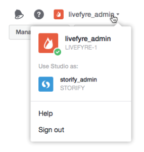

# Utenti che passano da una rete all&#39;altra{#users-switching-networks}

È possibile gestire più reti da un singolo account Studio.

>[!NOTE]
>
>Questo non è comune.

Nel menu a discesa **[!UICONTROL Account]** sono elencati tutti i nomi utente associati all&#39;account Studio a cui si è attualmente connessi e le reti a cui sono associati. Utilizzate questo pulldown per selezionare la rete da gestire.

>[!NOTE]
>
>Mentre la maggior parte degli utenti dispone di autorizzazioni per una sola rete, alcuni utenti di Studio possono possedere o moderare più siti. L&#39;account Studio consente loro di accedere con un singolo nome utente e una singola password, quindi di passare a più livelli di accesso al sito.

